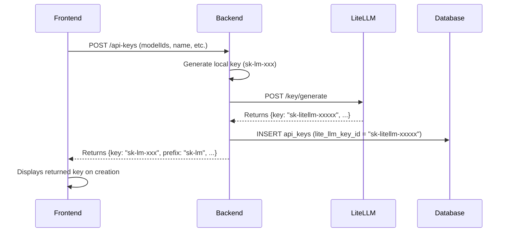
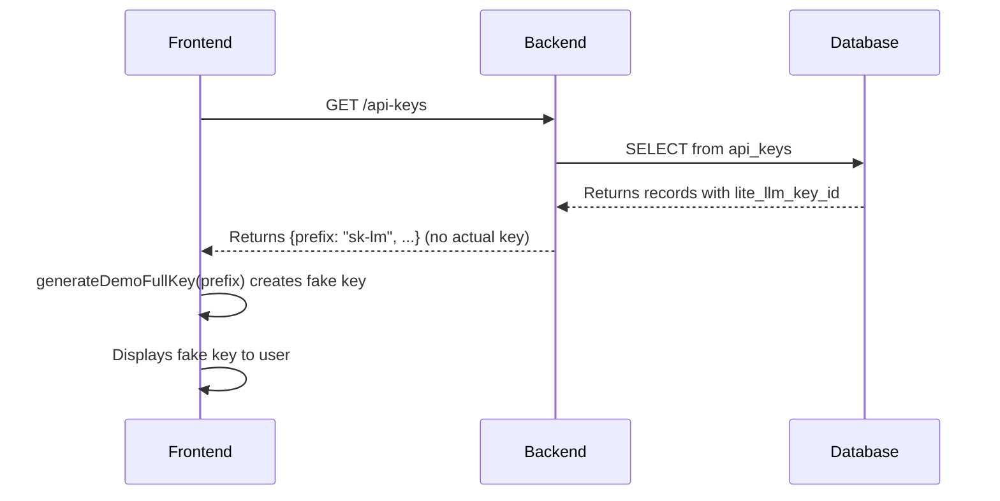

# API Key Management Correction Plan

## Executive Summary

This document outlines the critical issues with API key management in LiteMaaS and provides a comprehensive plan to correct the discrepancies between stored and displayed API key values.

## Current Issues Identified

### 1. Database Column Naming Confusion
- **Column Name**: `lite_llm_key_id` 
- **Actual Content**: Stores the full LiteLLM API key value (e.g., `sk-litellm-xxxxx`)
- **Issue**: The column name suggests it stores an ID, but it actually stores the complete key value

### 2. Frontend Displays Generated Mock Keys
- **Current Behavior**: Frontend generates fake API keys for display using `generateDemoFullKey()`
- **Issue**: Users see different keys than what's actually stored and usable with LiteLLM
- **Code Location**: `frontend/src/services/apiKeys.service.ts` lines 94-108

### 3. Real API Key Only Shown on Creation
- **Current Behavior**: The actual LiteLLM key is only returned and displayed when first created
- **Issue**: Users cannot retrieve their actual API key after the creation modal is closed

## Current Flow Analysis

### 1. API Key Creation Flow



### 2. API Key Retrieval Flow



## Key Findings

1. **Backend generates two different keys**:
   - Local key: `sk-lm-` prefix (stored in `key_hash` and `key_prefix`)
   - LiteLLM key: `sk-litellm-` prefix (stored in `lite_llm_key_id`)

2. **Frontend never receives the actual LiteLLM key** except during creation:
   - Backend only returns the local key on creation
   - Backend never returns the LiteLLM key on subsequent retrievals
   - Frontend generates fake keys for display

3. **Users need the LiteLLM key** to make API calls, not the local key

## Proposed Solution

### Phase 1: Immediate Corrections

#### 1.1 Backend Changes

**File**: `backend/src/services/api-key.service.ts`

1. **Update `createApiKey` method** to return the LiteLLM key:
   ```typescript
   // Line 238: Store the API key (without subscription_id for new keys)
   const apiKey = await client.query(
     `INSERT INTO api_keys (
       user_id, name, key_hash, key_prefix, 
       expires_at, is_active, lite_llm_key_id,
       // ... other fields
     ) VALUES ($1, $2, $3, $4, $5, $6, $7, ...)
     RETURNING *`,
     // parameters
   );
   
   // Return the LiteLLM key, not the local key
   return {
     // ... other fields
     key: liteLLMResponse.key, // Return LiteLLM key instead of local key
     liteLLMKeyId: liteLLMResponse.key, // Also include for clarity
   };
   ```

2. **Add method to retrieve API keys with masked LiteLLM keys**:
   ```typescript
   // In mapToEnhancedApiKey method
   private mapToEnhancedApiKey(
     apiKey: ApiKeyRow,
     liteLLMData?: LiteLLMKeyData,
   ): EnhancedApiKey {
     return {
       // ... existing fields
       liteLLMKeyPrefix: apiKey.lite_llm_key_id 
         ? apiKey.lite_llm_key_id.substring(0, 15) + '...'
         : undefined,
       // Never return full LiteLLM key in list operations
     };
   }
   ```

3. **Add secure endpoint to retrieve full key** (with additional authentication):
   ```typescript
   // New method in ApiKeyService
   async retrieveFullKey(keyId: string, userId: string): Promise<string> {
     // Verify ownership
     const apiKey = await this.getApiKey(keyId, userId);
     if (!apiKey) {
       throw this.fastify.createNotFoundError('API key not found');
     }
     
     // Log the access for audit
     await this.fastify.dbUtils.query(
       `INSERT INTO audit_logs (user_id, action, resource_type, resource_id, metadata)
        VALUES ($1, $2, $3, $4, $5)`,
       [userId, 'API_KEY_RETRIEVE', 'API_KEY', keyId, { timestamp: new Date() }]
     );
     
     // Return the actual LiteLLM key
     return apiKey.lite_llm_key_id;
   }
   ```

#### 1.2 API Route Changes

**File**: `backend/src/routes/api-keys.ts`

1. **Update POST response** to include LiteLLM key info:
   ```typescript
   // Line 161: Update response
   return {
     id: apiKey.id,
     name: apiKey.name,
     key: apiKey.key, // This should be the LiteLLM key
     liteLLMKey: apiKey.key, // Explicit field for clarity
     prefix: apiKey.keyPrefix,
     // ... other fields
   };
   ```

2. **Add new endpoint** for retrieving full key:
   ```typescript
   // New endpoint: POST /api-keys/:id/retrieve-key
   fastify.post<{
     Params: { id: string };
     Reply: { key: string };
   }>('/:id/retrieve-key', {
     schema: {
       tags: ['API Keys'],
       description: 'Retrieve full API key (requires re-authentication)',
       security: [{ bearerAuth: [] }],
       // ... schema
     },
     preHandler: [fastify.authenticateWithDevBypass, requireRecentAuth],
     handler: async (request, reply) => {
       const user = (request as AuthenticatedRequest).user;
       const { id } = request.params;
       
       const fullKey = await apiKeyService.retrieveFullKey(id, user.userId);
       
       return { key: fullKey };
     },
   });
   ```

#### 1.3 Frontend Changes

**File**: `frontend/src/services/apiKeys.service.ts`

1. **Remove fake key generation**:
   ```typescript
   private mapBackendToFrontend(backend: BackendApiKeyDetails): ApiKey {
     // Remove generateDemoFullKey function entirely
     
     return {
       id: backend.id,
       name: backend.name || 'Unnamed Key',
       keyPreview: backend.prefix + '...',
       fullKey: undefined, // Don't generate fake keys
       isLiteLLMKey: true, // Add flag to indicate this uses LiteLLM
       // ... other fields
     };
   }
   ```

2. **Update create method** to handle LiteLLM key:
   ```typescript
   async createApiKey(request: CreateApiKeyRequest): Promise<ApiKey> {
     const response = await apiClient.post<BackendApiKeyDetails>('/api-keys', request);
     const mappedKey = this.mapBackendToFrontend(response);
     
     // Store the actual LiteLLM key from creation response
     if ((response as any).liteLLMKey || (response as any).key) {
       mappedKey.fullKey = (response as any).liteLLMKey || (response as any).key;
       mappedKey.keyType = 'litellm'; // Indicate this is a LiteLLM key
     }
     
     return mappedKey;
   }
   ```

3. **Add method to retrieve full key**:
   ```typescript
   async retrieveFullKey(keyId: string): Promise<string> {
     const response = await apiClient.post<{ key: string }>(`/api-keys/${keyId}/retrieve-key`);
     return response.key;
   }
   ```

**File**: `frontend/src/pages/ApiKeysPage.tsx`

1. **Update key display** to show it's a LiteLLM key:
   ```typescript
   // Line 435: Update key display
   <code style={{ fontFamily: 'monospace', fontSize: '0.875rem' }}>
     {visibleKeys.has(apiKey.id) && apiKey.fullKey 
       ? apiKey.fullKey 
       : `${apiKey.keyPreview} (LiteLLM Key)`}
   </code>
   ```

2. **Add "Retrieve Key" functionality**:
   ```typescript
   const handleRetrieveKey = async (apiKey: ApiKey) => {
     try {
       const fullKey = await apiKeysService.retrieveFullKey(apiKey.id);
       // Update the local state with the retrieved key
       setApiKeys(prev => prev.map(k => 
         k.id === apiKey.id ? { ...k, fullKey } : k
       ));
       setVisibleKeys(prev => new Set([...prev, apiKey.id]));
       
       addNotification({
         title: 'API Key Retrieved',
         description: 'Your API key has been retrieved securely',
         variant: 'success'
       });
     } catch (error) {
       addNotification({
         title: 'Error',
         description: 'Failed to retrieve API key. Additional authentication may be required.',
         variant: 'danger'
       });
     }
   };
   ```

3. **Update usage example** to clarify LiteLLM endpoint:
   ```typescript
   // Line 782: Update curl example
   <CodeBlockCode>
   {`# Using LiteLLM API endpoint
   curl -X POST ${litellmApiUrl}/v1/chat/completions \\
     -H "Authorization: Bearer ${selectedApiKey.fullKey || '<your-litellm-key>'}" \\
     -H "Content-Type: application/json" \\
     -d '{
       "model": "${selectedApiKey.models?.[0] || 'gpt-4'}",
       "messages": [{"role": "user", "content": "Hello, world!"}]
     }'`}
   </CodeBlockCode>
   ```

### Phase 2: Database Schema Improvements

#### 2.1 Column Rename Migration

Create a migration to rename the confusing column:

```sql
-- Migration: Rename lite_llm_key_id to lite_llm_key_value
ALTER TABLE api_keys 
RENAME COLUMN lite_llm_key_id TO lite_llm_key_value;

-- Update index
DROP INDEX IF EXISTS idx_api_keys_lite_llm;
CREATE INDEX idx_api_keys_lite_llm_value ON api_keys(lite_llm_key_value);

-- Add comment for clarity
COMMENT ON COLUMN api_keys.lite_llm_key_value IS 'The actual LiteLLM API key value (e.g., sk-litellm-xxxxx)';
```

#### 2.2 Add Security Columns

```sql
-- Add columns for better key management
ALTER TABLE api_keys
ADD COLUMN key_type VARCHAR(20) DEFAULT 'litellm',
ADD COLUMN last_retrieved_at TIMESTAMP,
ADD COLUMN retrieval_count INTEGER DEFAULT 0;
```

### Phase 3: Security Enhancements

1. **Implement key retrieval rate limiting**
2. **Add two-factor authentication for key retrieval**
3. **Implement key rotation reminders**
4. **Add audit logging for all key operations**

## Migration Strategy

### For Existing Data

1. **No data migration needed** for `lite_llm_key_id` values - they already contain the correct LiteLLM keys
2. **Update frontend** to stop displaying fake keys
3. **Add notification** for existing users to re-authenticate to view their keys

### Rollout Plan

1. **Phase 1**: Deploy backend changes with backward compatibility
2. **Phase 2**: Deploy frontend changes 
3. **Phase 3**: Run database migration during maintenance window
4. **Phase 4**: Update all references to use new column name

## Testing Requirements

1. **Unit Tests**:
   - Test API key creation returns LiteLLM key
   - Test key retrieval endpoint with auth
   - Test frontend doesn't generate fake keys

2. **Integration Tests**:
   - Test full flow from creation to usage
   - Test key retrieval with proper auth
   - Test backward compatibility

3. **Security Tests**:
   - Test rate limiting on key retrieval
   - Test audit logging
   - Test unauthorized access attempts

## Timeline

- **Week 1**: Implement Phase 1 corrections
- **Week 2**: Testing and security review
- **Week 3**: Deploy to staging
- **Week 4**: Production deployment
- **Week 5**: Database migration
- **Week 6**: Monitoring and adjustments

## Success Metrics

1. Users can retrieve their actual LiteLLM keys
2. No fake keys displayed in frontend
3. Clear indication of key type (LiteLLM)
4. Audit trail for key retrievals
5. No breaking changes for existing integrations

## Conclusion

This plan addresses the critical issue of displaying incorrect API keys to users. By implementing these changes, users will be able to access their actual LiteLLM keys while maintaining security through controlled retrieval mechanisms.