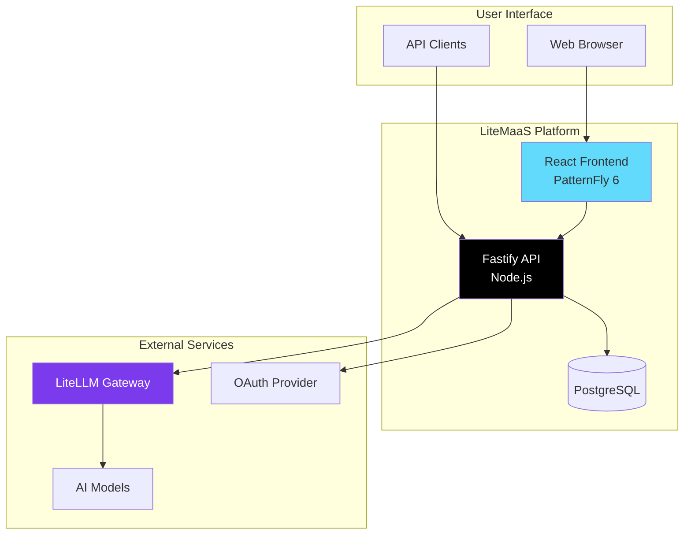

# LiteMaaS Documentation

Welcome to the LiteMaaS documentation! This guide will help you understand, deploy, and contribute to the LiteMaaS platform.

## 📚 Documentation Structure

### Getting Started
- **[Architecture Overview](architecture/overview.md)** - System design and components
- **[Development Setup](development/setup.md)** - Local development environment
- **[API Quick Start](api/)** - API documentation and examples

### Core Documentation

#### 🏗️ Architecture
- **[System Overview](architecture/overview.md)** - High-level architecture with diagrams
- **[Database Schema](architecture/database-schema.md)** - Complete database design
- **[Services](architecture/services.md)** - Backend service architecture
- **[LiteLLM Integration](architecture/litellm-integration.md)** - Model proxy integration

#### 🔌 API Reference
- **[REST API](api/rest-api.md)** - Complete API endpoint reference
- **[Model Sync API](api/model-sync-api.md)** - Model synchronization endpoints
- **[Usage API](api/usage-api.md)** - Usage tracking and analytics
- **[Migration Guide](api/api-migration-guide.md)** - Upgrading to multi-model keys

#### 🚀 Deployment
- **[Configuration](deployment/configuration.md)** - Environment variables and settings
- **[OpenShift Deployment](deployment/openshift-deployment.md)** - Kubernetes/OpenShift guide
- **[Container Deployment](deployment/containers.md)** - Docker/Podman deployment
- **[Production Guide](deployment/production-guide.md)** - Production best practices
- **[Authentication Setup](deployment/authentication.md)** - OAuth configuration

#### 💻 Development
- **[Setup Guide](development/setup.md)** - Local development environment
- **[Backend Guide](development/backend-guide.md)** - Fastify development
- **[UI Guidelines](development/ui-guidelines.md)** - PatternFly 6 best practices
- **[Migration Notes](development/migration-notes.md)** - Database migrations

#### ✨ Features
- **[Multi-Model API Keys](features/multi-model-api-keys-implementation.md)** - Enhanced API key system
- **[Default Team](features/default-team-implementation.md)** - Team-based user management
- **[Authentication Flow](features/authentication-flow.md)** - OAuth integration details

## 🎯 Quick Links by Role

### For Developers
1. Start with [Development Setup](development/setup.md)
2. Review [Architecture Overview](architecture/overview.md)
3. Check [API Documentation](api/)
4. Follow [UI Guidelines](development/ui-guidelines.md)

### For DevOps/SREs
1. Read [OpenShift Deployment](deployment/openshift-deployment.md)
2. Configure using [Configuration Guide](deployment/configuration.md)
3. Review [Production Guide](deployment/production-guide.md)
4. Set up [Authentication](deployment/authentication.md)

### For API Users
1. Start with [API Quick Start](api/)
2. Review [REST API Reference](api/rest-api.md)
3. Learn about [Multi-Model Keys](api/api-migration-guide.md)
4. Check [Usage API](api/usage-api.md)

## 📊 Architecture Diagram

## 🤝 Contributing

See our [Contributing Guide](../CONTRIBUTING.md) for information on:
- Code style and conventions
- Pull request process
- Testing requirements
- Documentation standards

## 📞 Support

- **Documentation**: You're here!
- **Issues**: [GitHub Issues](https://github.com/your-org/litemaas/issues)
- **Discussions**: [GitHub Discussions](https://github.com/your-org/litemaas/discussions)