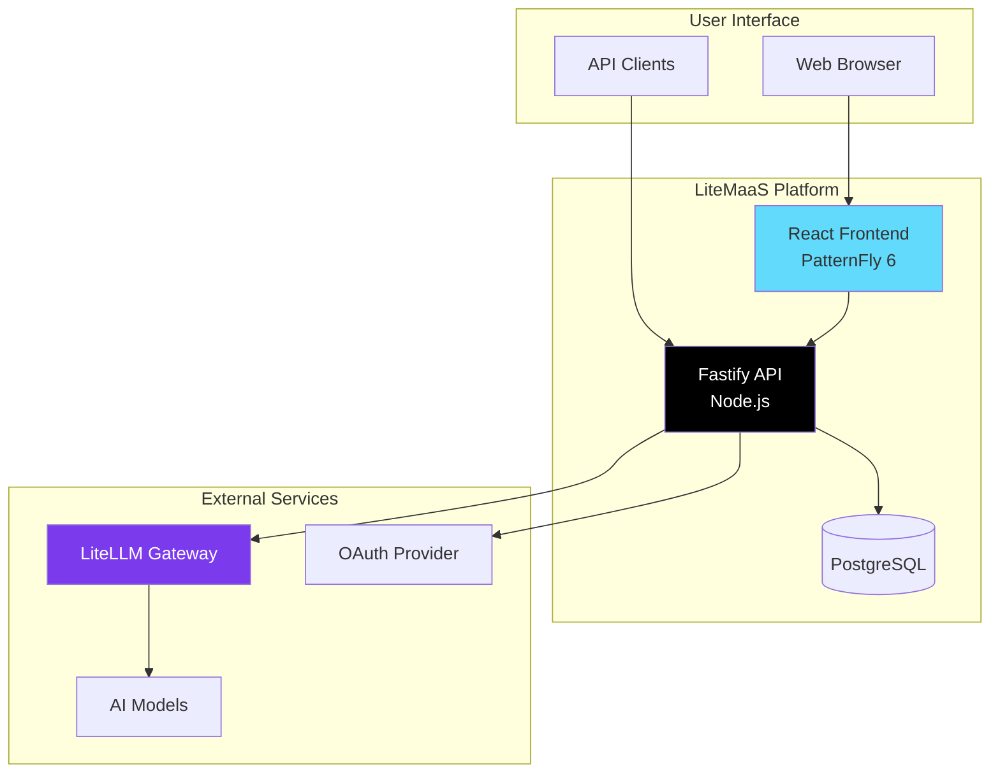

# LiteMaaS Documentation

Welcome to the LiteMaaS documentation! This guide will help you understand, deploy, and contribute to the LiteMaaS platform.

## 📚 Documentation Structure

### Getting Started

- **[Architecture Overview](architecture/overview.md)** - System design and components
- **[Development Setup](development/setup.md)** - Local development environment
- **[API Quick Start](api/README.md)** - API documentation and examples

### Core Documentation

#### 🏗️ Architecture

- **[System Overview](architecture/overview.md)** - High-level architecture with diagrams
- **[Project Structure](architecture/project-structure.md)** - Complete directory structure and file organization
- **[Database Schema](architecture/database-schema.md)** - Complete database design
- **[Services](architecture/services.md)** - Backend service architecture
- **[LiteLLM Integration](architecture/litellm-integration.md)** - Model proxy integration

#### 🔌 API Reference

- **[REST API](api/rest-api.md)** - Complete API endpoint reference
- **[LiteLLM API](api/litellm-api.md)** - LiteLLM integration endpoints
- **[Model Sync API](api/model-sync-api.md)** - Model synchronization endpoints
- **[Usage API](api/usage-api.md)** - Usage tracking and analytics
- **[Migration Guide](api/api-migration-guide.md)** - Upgrading to multi-model keys

#### 🚀 Deployment

- **[Configuration](deployment/configuration.md)** - Environment variables and settings
- **[OpenShift Deployment](deployment/openshift-deployment.md)** - Kubernetes/OpenShift guide
- **[Container Deployment](deployment/containers.md)** - Docker/Podman deployment
- **[Production Guide](deployment/production-guide.md)** - Production best practices
- **[Authentication Setup](deployment/authentication.md)** - OAuth configuration
- **[OAuth Setup Guide](deployment/oauth-setup.md)** - Detailed OAuth configuration

#### 💻 Development

- **[Setup Guide](development/setup.md)** - Local development environment
- **[Backend Guide](development/backend-guide.md)** - Fastify development
- **[UI Guidelines](development/pf6-guide/README.md)** - PatternFly 6 comprehensive guide with setup, components, and patterns
- **[Error Handling Guide](development/error-handling.md)** - Comprehensive error handling patterns
- **[Translation Management](development/translation-management.md)** - i18n and translation tools
- **[Migration Notes](development/migration-notes.md)** - Database migrations
- **[Model Sync Fix](development/fix-model-sync-implementation.md)** - Model sync implementation fixes
- **[Test Chatbot Plan](development/test-chatbot-implementation-plan.md)** - Chatbot implementation planning
- **[Accessibility Guide](development/accessibility/README.md)** - WCAG 2.1 AA compliance and testing
  - **[ARIA Live Regions](development/accessibility/aria-live-regions.md)** - Screen reader announcements
  - **[Accessibility Patterns](development/accessibility/patterns.md)** - Common accessibility patterns
  - **[Frontend Testing](development/accessibility/frontend-testing.md)** - Accessibility testing
  - **[Testing Guide](development/accessibility/testing-guide.md)** - Comprehensive testing approaches

#### ✨ Features

- **[Admin Usage Analytics](features/admin-usage-analytics-implementation-plan.md)** - **[Major Feature - 2025 Q3]** Enterprise-grade analytics with day-by-day incremental caching, multi-dimensional filtering, and dynamic config integration (2000 lines comprehensive implementation plan)
- **[Multi-Model API Keys](features/multi-model-api-keys-implementation.md)** - Enhanced API key system
- **[Default Team](features/default-team-implementation.md)** - Team-based user management
- **[Authentication Flow](features/authentication-flow.md)** - OAuth integration details
- **[RBAC](features/user-roles-administration.md)** - Administration roles and permissions
- **[Admin Tools](features/admin-tools.md)** - Administrative tools and model sync
- **[Model Configuration Testing](features/model-configuration-testing.md)** - Configuration validation feature
- **[Chatbot Implementation](development/chatbot-implementation.md)** - AI chatbot integration
- **[Test Chatbot](features/test-chatbot.md)** - Chatbot testing guide
- **[Chatbot Enhancements](features/chatbot-future-enhancements.md)** - Future chatbot features
- **[Model Sync](development/model-sync.md)** - Model synchronization processes

#### 📁 Archive & History

- **[Changelogs](archive/changelogs/)** - Feature update and API change histories
  - **[API Key Features](archive/changelogs/api-key-edit-feature-2025-01.md)** - API key editing features
  - **[Multi-Model Keys](archive/changelogs/multi-model-api-keys-changelog.md)** - Multi-model API key changes
- **[Debug & Analysis](archive/debug/)** - Historical debug sessions and analysis
  - **[Auth Debug Logs](archive/debug/auth-debug-logs.md)** - Authentication debugging
  - **[Security Test Results](archive/debug/security-test-results.md)** - Security testing results
  - **[Workflow Analysis](archive/debug/workflow-analysis.md)** - Development workflow analysis
- **[Historical Documentation](archive/)** - Legacy architecture and planning docs
  - **[Error Handling Architecture](archive/error-handling-architecture.md)** - Original error handling design
  - **[Implementation Plans](archive/project-planning/implementation-plan-phase9.md)** - Historical planning documents

## 🎯 Quick Links by Role

### For Developers

1. Start with [Development Setup](development/setup.md)
2. Review [Architecture Overview](architecture/overview.md)
3. Check [API Documentation](api/)
4. Follow [UI Guidelines](development/pf6-guide/README.md)

### For DevOps/SREs

1. Read [OpenShift Deployment](deployment/openshift-deployment.md)
2. Configure using [Configuration Guide](deployment/configuration.md)
3. Review [Production Guide](deployment/production-guide.md)
4. Set up [Authentication](deployment/authentication.md)

### For API Users

1. Start with [API Quick Start](api/README.md)
2. Review [REST API Reference](api/rest-api.md)
3. Learn about [Multi-Model Keys](api/api-migration-guide.md)
4. Check [Usage API](api/usage-api.md)

## 📊 Architecture Diagram



## 🤝 Contributing

See our [Contributing Guide](../CONTRIBUTING.md) for information on:

- Code style and conventions
- Pull request process
- Testing requirements
- Documentation standards

## 📞 Support

- **Documentation**: You're here!
- **Issues**: [GitHub Issues](https://github.com/rh-aiservices-bu/litemaas/issues)
- **Discussions**: [GitHub Discussions](https://github.com/rh-aiservices-bu/litemaas/discussions)

## 🤖 For AI Assistants (Claude)

### Quick Document Lookup

- **Project Structure**: `docs/architecture/project-structure.md`
- **Error Handling**: `docs/development/error-handling.md`
- **Admin Features**: `docs/features/admin-tools.md`
- **User Roles/RBAC**: `docs/features/user-roles-administration.md`
- **PatternFly 6 Components**: `docs/development/pf6-guide/`
- **Accessibility Testing**: `docs/development/accessibility/`
- **API Documentation**: `docs/api/rest-api.md`
- **Authentication Setup**: `docs/deployment/authentication.md`
- **Chatbot Implementation**: `docs/development/chatbot-implementation.md`
- **Archive/History**: `docs/archive/`

### Document Discovery Commands

```bash
# Find all documentation files
find docs -name "*.md" | sort

# Search for content across all docs
grep -r "search_term" docs/

# List files by category
ls docs/development/     # Development guides
ls docs/features/        # Feature documentation
ls docs/api/            # API documentation
ls docs/deployment/     # Deployment guides
ls docs/archive/        # Historical documents

# Recent documentation changes
git log --oneline docs/
```

### Navigation Tips

- **Start with**: `docs/README.md` (this file) for complete index
- **Development**: Begin with `docs/development/setup.md`
- **Architecture**: Review `docs/architecture/overview.md`
- **Specific features**: Check `docs/features/` directory
- **API integration**: See `docs/api/` directory
- **Production deployment**: Use `docs/deployment/` guides
