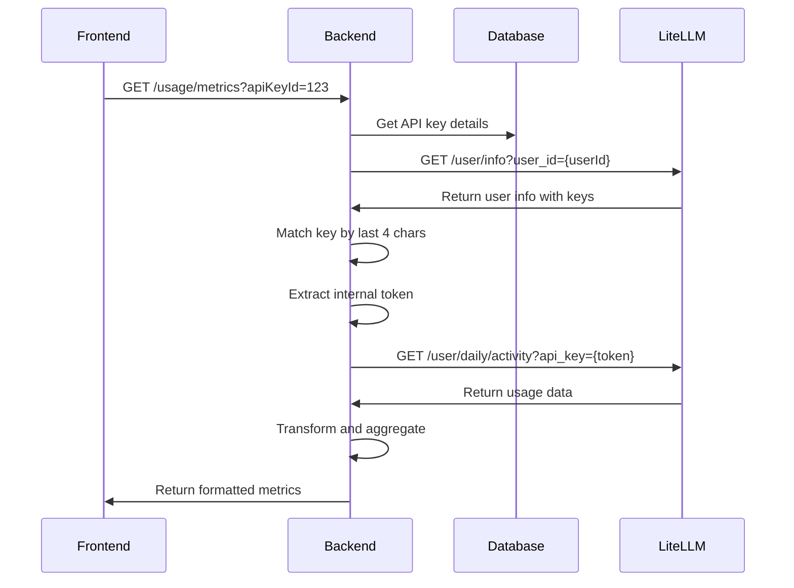

# Usage API Documentation

## Overview

The Usage API provides endpoints for tracking and analyzing API usage, including token consumption, request counts, and cost metrics. The API integrates with LiteLLM to fetch real-time usage data.

## Authentication

All usage endpoints require JWT authentication via Bearer token:

```http
Authorization: Bearer <jwt-token>
```

## Key Concepts

### Usage Data Sources

1. **LiteLLM Integration**: Primary source for real-time usage data
2. **Local Database**: Fallback and historical data storage
3. **Mock Data**: Available in development mode

### API Key Token Resolution

The usage tracking system uses a multi-step process to retrieve data from LiteLLM:

1. **Get User Info**: Query `/user/info?user_id={userId}` to get all API keys
2. **Match API Key**: Find key where last 4 characters of `key_name` match stored key
3. **Extract Token**: Use the internal `token` field for usage queries
4. **Query Usage**: Call `/user/daily/activity?api_key={token}` with internal token

## Endpoints

### Get Usage Metrics

Retrieve usage metrics for the frontend dashboard.

**Endpoint:** `GET /api/v1/usage/metrics`

**Query Parameters:**
| Parameter | Type | Required | Description |
|-----------|------|----------|-------------|
| startDate | string | No | Start date (YYYY-MM-DD) |
| endDate | string | No | End date (YYYY-MM-DD) |
| modelId | string | No | Filter by specific model |
| apiKeyId | string | No | Filter by specific API key |

**Response:**

```json
{
  "totalRequests": 125000,
  "totalTokens": 8500000,
  "totalCost": 127.5,
  "averageResponseTime": 1.2,
  "successRate": 99.2,
  "activeModels": 4,
  "topModels": [
    {
      "name": "gpt-4",
      "requests": 45000,
      "tokens": 3200000,
      "cost": 96.0
    }
  ],
  "dailyUsage": [
    {
      "date": "2025-08-01",
      "requests": 18000,
      "tokens": 1200000,
      "cost": 18.0
    }
  ],
  "hourlyUsage": [
    {
      "hour": "14:00",
      "requests": 523
    }
  ],
  "errorBreakdown": [
    {
      "type": "Rate Limit",
      "count": 125,
      "percentage": 1.0
    }
  ]
}
```

### Get Usage Summary

Retrieve aggregated usage statistics.

**Endpoint:** `GET /api/v1/usage/summary`

**Query Parameters:**
| Parameter | Type | Required | Description |
|-----------|------|----------|-------------|
| startDate | string | Yes | Start date (YYYY-MM-DD) |
| endDate | string | Yes | End date (YYYY-MM-DD) |
| modelId | string | No | Filter by model |
| subscriptionId | string | No | Filter by subscription |
| granularity | string | No | hour, day, week, month (default: day) |

**Response:**

```json
{
  "period": {
    "start": "2025-07-01T00:00:00Z",
    "end": "2025-07-31T23:59:59Z"
  },
  "totals": {
    "requests": 125000,
    "tokens": 8500000,
    "cost": 127.5,
    "inputTokens": 5100000,
    "outputTokens": 3400000,
    "averageLatency": 1200,
    "errorRate": 0.8,
    "successRate": 99.2
  },
  "byModel": [
    {
      "modelId": "gpt-4",
      "modelName": "GPT-4",
      "requests": 45000,
      "tokens": 3200000,
      "cost": 96.0
    }
  ]
}
```

### Get Time Series Data

Retrieve usage data over time.

**Endpoint:** `GET /api/v1/usage/timeseries`

**Query Parameters:**
| Parameter | Type | Required | Description |
|-----------|------|----------|-------------|
| startDate | string | Yes | Start date (YYYY-MM-DD) |
| endDate | string | Yes | End date (YYYY-MM-DD) |
| interval | string | No | hour, day, week, month (default: day) |
| modelId | string | No | Filter by model |
| subscriptionId | string | No | Filter by subscription |

**Response:**

```json
{
  "interval": "day",
  "data": [
    {
      "period": "2025-08-01",
      "startTime": "2025-08-01T00:00:00Z",
      "endTime": "2025-08-01T23:59:59Z",
      "totalRequests": 18000,
      "totalTokens": 1200000,
      "totalInputTokens": 720000,
      "totalOutputTokens": 480000,
      "averageLatency": 1150,
      "errorRate": 0.5,
      "successRate": 99.5
    }
  ]
}
```

### Get Usage Dashboard

Retrieve comprehensive dashboard data.

**Endpoint:** `GET /api/v1/usage/dashboard`

**Query Parameters:**
| Parameter | Type | Required | Description |
|-----------|------|----------|-------------|
| timeRange | string | No | day, week, month (default: month) |

**Response:**

```json
{
  "summary": {
    "currentPeriod": {
      "requests": 125000,
      "tokens": 8500000,
      "cost": 127.5
    },
    "previousPeriod": {
      "requests": 108000,
      "tokens": 7300000,
      "cost": 109.5
    },
    "percentChange": {
      "requests": 15.7,
      "tokens": 16.4,
      "cost": 16.4
    },
    "quotaUtilization": {
      "requests": 62.5,
      "tokens": 42.5,
      "budget": 25.5
    }
  },
  "topStats": {
    "topModels": [
      {
        "modelId": "gpt-4",
        "modelName": "GPT-4",
        "totalRequests": 45000,
        "totalTokens": 3200000
      }
    ],
    "recentActivity": [
      {
        "timestamp": "2025-08-04T14:23:45Z",
        "modelId": "gpt-4",
        "requestTokens": 1523,
        "responseTokens": 892,
        "statusCode": 200
      }
    ]
  }
}
```

### Get Top Statistics

Retrieve top usage statistics.

**Endpoint:** `GET /api/v1/usage/top`

**Query Parameters:**
| Parameter | Type | Required | Description |
|-----------|------|----------|-------------|
| timeRange | string | No | day, week, month (default: month) |
| limit | number | No | Max results (1-50, default: 10) |

### Export Usage Data

Export usage data in CSV or JSON format.

**Endpoint:** `GET /api/v1/usage/export`

**Query Parameters:**
| Parameter | Type | Required | Description |
|-----------|------|----------|-------------|
| startDate | string | No | Start date (YYYY-MM-DD) |
| endDate | string | No | End date (YYYY-MM-DD) |
| format | string | No | csv, json (default: csv) |
| modelId | string | No | Filter by model |
| subscriptionId | string | No | Filter by subscription |
| apiKeyId | string | No | Filter by API key |

**Response:**

- CSV: Returns file download with Content-Type: text/csv
- JSON: Returns structured JSON with metadata

### Track Usage (Internal)

Record real-time usage for API requests.

**Endpoint:** `POST /api/v1/usage/track`

**Required Permission:** `usage:write`

**Request Body:**

```json
{
  "subscriptionId": "sub_123",
  "modelId": "gpt-4",
  "requestTokens": 1523,
  "responseTokens": 892,
  "latencyMs": 1245,
  "statusCode": 200
}
```

## Admin Endpoints

### Get Global Usage Statistics

**Endpoint:** `GET /api/v1/usage/admin/global`

**Required Permission:** `admin:usage`

**Query Parameters:**
| Parameter | Type | Required | Description |
|-----------|------|----------|-------------|
| startDate | string | No | Start date |
| endDate | string | No | End date |
| granularity | string | No | hour, day, week, month |
| aggregateBy | string | No | model, user, time |

### Cleanup Old Usage Data

**Endpoint:** `POST /api/v1/usage/admin/cleanup`

**Required Permission:** `admin:usage`

**Request Body:**

```json
{
  "retentionDays": 90
}
```

## Implementation Details

### LiteLLM Integration Flow



### Caching Strategy

- Usage data cached for 5 minutes
- Cache key format: `usage:{userId}:{apiKeyId}:{startDate}:{endDate}`
- Cache invalidated on new usage tracking

### Error Handling

1. **LiteLLM Unavailable**: Falls back to local database
2. **API Key Not Found**: Returns empty metrics
3. **Token Match Failed**: Falls back to local database
4. **Invalid Date Range**: Returns 400 Bad Request

## Development Mode

When `NODE_ENV=development` or `LITELLM_MOCK_ENABLED=true`:

- Returns realistic mock data
- Simulates various usage patterns
- No LiteLLM connection required
- Useful for frontend development

## Performance Considerations

1. **Batch Queries**: Aggregate multiple date ranges in single request
2. **Caching**: 5-minute cache for frequently accessed data
3. **Database Indexes**: Optimized for time-based queries
4. **Pagination**: Large datasets paginated automatically

## Rate Limiting

- Standard endpoints: 100 requests per minute
- Export endpoint: 10 requests per minute
- Admin endpoints: 20 requests per minute
