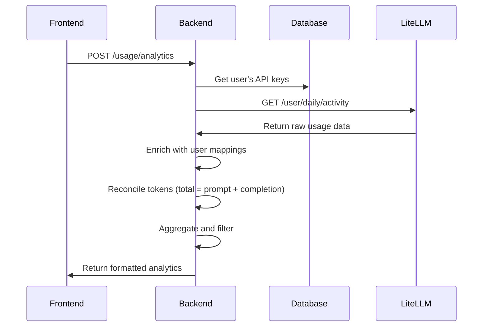

# Usage API Documentation

## Overview

The Usage API provides endpoints for tracking and analyzing API usage, including token consumption, request counts, and cost metrics. The API integrates with LiteLLM to fetch real-time usage data.

## Authentication

All usage endpoints require JWT authentication via Bearer token:

```http
Authorization: Bearer <jwt-token>
```

## Key Concepts

### Usage Data Sources

1. **LiteLLM Integration**: Primary source for real-time usage data
2. **Local Database**: Fallback and historical data storage
3. **Mock Data**: Available in development mode

### API Key Token Resolution

The usage tracking system uses a multi-step process to retrieve data from LiteLLM:

1. **Get User Info**: Query `/user/info?user_id={userId}` to get all API keys
2. **Match API Key**: Find key where last 4 characters of `key_name` match stored key
3. **Extract Token**: Use the internal `token` field for usage queries
4. **Query Usage**: Call `/user/daily/activity?api_key={token}` with internal token

## Endpoints

### User Analytics

Get comprehensive usage analytics for the current user. Uses the same analytics engine as the admin analytics endpoint, automatically scoped to the current user.

**Endpoint:** `POST /api/v1/usage/analytics`

**Request Body:**

```json
{
  "startDate": "2025-01-01",
  "endDate": "2025-01-31",
  "modelIds": ["gpt-4", "gpt-3.5"],
  "providerIds": ["openai"],
  "apiKeyIds": ["key-alias-1"]
}
```

**Response:** Same format as `POST /api/v1/admin/usage/analytics` (see Admin Endpoints section), scoped to the authenticated user's data only.

### Export Usage Data

Export usage data in CSV or JSON format. Uses the admin analytics pipeline for consistent token reconciliation (`total_tokens = prompt_tokens + completion_tokens`).

**Endpoint:** `POST /api/v1/usage/export`

**Request Body:**

| Field | Type | Required | Description |
|-------|------|----------|-------------|
| startDate | string | Yes | Start date (YYYY-MM-DD) |
| endDate | string | Yes | End date (YYYY-MM-DD) |
| format | string | No | csv, json (default: csv) |
| modelIds | string[] | No | Filter by model IDs |
| providerIds | string[] | No | Filter by provider IDs |
| apiKeyIds | string[] | No | Filter by API key aliases |

**Response:**

- CSV: Returns file download with Content-Type: text/csv
- JSON: Returns structured JSON with metadata

**Notes:**
- Date range limited to 365 days maximum
- API key IDs are validated against the authenticated user's keys
- Data is automatically scoped to the authenticated user

## Admin Endpoints

Admin usage analytics provides comprehensive system-wide visibility with intelligent caching and multi-dimensional filtering.

### Architecture Overview

**Data Source**: LiteLLM `/user/daily/activity` endpoint
**Caching Layer**: `daily_usage_cache` table with intelligent TTL strategy
**Data Enrichment**: API key aliases mapped to users via local database

### Caching Strategy

The admin usage analytics system implements a sophisticated caching strategy optimized for both performance and data freshness:

**Historical Days (> 1 day old)**:

- Cached permanently with `is_complete = true`
- Never refreshed (immutable historical data)
- Serves as permanent historical record

**Current Day**:

- 5-minute TTL with `is_complete = false`
- Automatic stale detection based on `last_refreshed_at` timestamp
- Refreshed on demand via `/refresh-today` endpoint
- Auto-refreshed when data is older than 5 minutes

**Missing Days**:

- Fetched from LiteLLM on demand
- Immediately cached for future requests
- Prevents repeated API calls for same date range

### Data Enrichment Process

1. Fetch raw usage data from LiteLLM `/user/daily/activity`
2. Extract API key aliases from response (`api_key` field)
3. Query local database: `SELECT user_id, username, email FROM api_keys WHERE litellm_key_alias IN (...)`
4. Map API keys to users and aggregate by:
   - User (userId, username, email, role)
   - Model (modelId, modelName, provider)
   - Provider (provider name)
5. Calculate trends with comparison periods
6. Cache enriched data in `daily_usage_cache` table

### Why POST for Analytics Endpoints?

Most analytics endpoints (`/analytics`, `/by-user`, `/by-model`, `/by-provider`, `/export`) use POST instead of GET to support large filter arrays that would exceed URL length limits.

**Key Reasons:**

- **URL Length Limits**: Browsers (2048 chars) and web servers (4096-8192 chars) have strict URL length limits
- **Large Filter Arrays**: Filtering by 100+ user IDs or API key IDs creates URLs exceeding these limits
  - Example: 100 UUIDs × 36 chars each = 3,600+ character URLs
- **HTTP Compliance**: RFC 7231 allows POST for complex queries when GET is impractical
- **Hybrid Pattern**: Filters in request body (unlimited size), pagination in query string (standard HTTP semantics)

See [REST API Documentation](rest-api.md#admin-usage-analytics-apiv1adminusage) for detailed technical rationale.

### Admin Analytics Endpoint

**Endpoint:** `POST /api/v1/admin/usage/analytics`

**Required Permission:** `admin:usage` (admin or adminReadonly role)

**Description**: Comprehensive global usage metrics with trend analysis across all users

**Request Body:**

```json
{
  "startDate": "2024-01-01",
  "endDate": "2024-01-31",
  "userIds": ["uuid1", "uuid2"], // Optional filter
  "modelIds": ["gpt-4", "gpt-3.5"], // Optional filter
  "providerIds": ["openai", "azure"], // Optional filter
  "apiKeyIds": ["key1", "key2"] // Optional filter
}
```

**Response**: See [REST API Documentation](rest-api.md#admin-usage-analytics-apiv1adminusage) for complete response format.

### User Breakdown Endpoint

**Endpoint:** `POST /api/v1/admin/usage/by-user`

**Required Permission:** `admin:usage`

**Description**: Detailed usage metrics broken down by user. Uses POST to support large filter arrays.

**Request Body**: `startDate`, `endDate`, `userIds[]`, `modelIds[]`, `providerIds[]`, `apiKeyIds[]`

**Query Parameters** (Pagination): `page`, `limit`, `sortBy`, `sortOrder`

### Model Breakdown Endpoint

**Endpoint:** `POST /api/v1/admin/usage/by-model`

**Required Permission:** `admin:usage`

**Description**: Detailed usage metrics broken down by model. Uses POST to support large filter arrays.

**Request Body**: `startDate`, `endDate`, `userIds[]`, `modelIds[]`, `providerIds[]`, `apiKeyIds[]`

**Query Parameters** (Pagination): `page`, `limit`, `sortBy`, `sortOrder`

### Provider Breakdown Endpoint

**Endpoint:** `POST /api/v1/admin/usage/by-provider`

**Required Permission:** `admin:usage`

**Description**: Detailed usage metrics broken down by provider. Uses POST to support large filter arrays.

**Request Body**: `startDate`, `endDate`, `userIds[]`, `modelIds[]`, `providerIds[]`, `apiKeyIds[]`

**Query Parameters** (Pagination): `page`, `limit`, `sortBy`, `sortOrder`

### Export Endpoint

**Endpoint:** `POST /api/v1/admin/usage/export`

**Required Permission:** `admin:usage`

**Description**: Export comprehensive usage data in CSV or JSON format. Uses POST to support large filter arrays.

**Request Body**: `startDate`, `endDate`, `format` (csv/json), `userIds[]`, `modelIds[]`, `providerIds[]`, `apiKeyIds[]`

### Refresh Today Endpoint

**Endpoint:** `POST /api/v1/admin/usage/refresh-today`

**Required Permission:** `admin:usage` (admin role only, not adminReadonly)

**Description**: Force refresh of current day's usage data from LiteLLM

**Response:**

```json
{
  "message": "Current day usage data refreshed successfully",
  "refreshedAt": "2024-01-31T16:45:30Z",
  "status": "success"
}
```

### Filter Options Endpoint

**Endpoint:** `GET /api/v1/admin/usage/filter-options`

**Required Permission:** `admin:usage`

**Description**: Get available filter options based on actual usage data. Returns models and users with historical usage data in the specified date range.

**Query Parameters**: `startDate`, `endDate`

### Rebuild Cache Endpoint

**Endpoint:** `POST /api/v1/admin/usage/rebuild-cache`

**Required Permission:** `admin:usage` (admin role only)

**Description**: Rebuild aggregated cache columns from raw_data. Useful for fixing stale aggregated data when raw data is correct.

**Request Body (optional):**

```json
{
  "startDate": "2024-01-01",
  "endDate": "2024-01-31"
}
```

### Resync Usage Data Endpoint

**Endpoint:** `POST /api/v1/admin/usage/resync`

**Required Permission:** `admin:usage` (admin role only, not adminReadonly)

**Description**: Re-import usage data from LiteLLM for a selected date range. Deletes cached data for the date range and re-fetches each day with current enrichment logic (token reconciliation, user mapping). Useful after migrations or when cached data needs recalculation.

**Request Body:**

```json
{
  "startDate": "2024-01-01",
  "endDate": "2024-01-31"
}
```

**Response:**

```json
{
  "message": "Usage data resynced successfully",
  "daysProcessed": 31,
  "daysTotal": 31,
  "startDate": "2024-01-01",
  "endDate": "2024-01-31",
  "resyncedAt": "2024-02-01T10:30:00Z"
}
```

### Cache Metrics Endpoint

**Endpoint:** `GET /api/v1/admin/usage/cache/metrics`

**Required Permission:** `admin:usage`

**Description**: Get cache performance metrics including hit/miss rates, rebuild counts, and lock contention stats.

**Note**: For complete API specifications including all request/response formats, see [REST API Documentation](rest-api.md#admin-usage-analytics-apiv1adminusage).

## Implementation Details

### LiteLLM Integration Flow


```mermaid
sequenceDiagram
    participant Frontend
    participant Backend
    participant Database
    participant LiteLLM

    Frontend->>Backend: POST /usage/analytics
    Backend->>Database: Get user's API keys
    Backend->>LiteLLM: GET /user/daily/activity
    LiteLLM->>Backend: Return raw usage data
    Backend->>Backend: Enrich with user mappings
    Backend->>Backend: Reconcile tokens (total = prompt + completion)
    Backend->>Backend: Aggregate and filter
    Backend->>Frontend: Return formatted analytics
```

### Caching Strategy

**All Usage Endpoints** (`/api/v1/usage/*` and `/api/v1/admin/usage/*`):

Both user and admin analytics use the same pipeline backed by persistent database caching in `daily_usage_cache` table:

- Intelligent TTL strategy:
  - Historical days (> 1 day): Permanent cache (`is_complete = true`)
  - Current day: 5-minute TTL with stale detection (`is_complete = false`)
  - Missing days: Fetched from LiteLLM on demand and cached
- See [Admin Endpoints](#admin-endpoints) section for complete caching details

### Error Handling

1. **LiteLLM Unavailable**: Falls back to local database
2. **API Key Not Found**: Returns empty metrics
3. **Token Match Failed**: Falls back to local database
4. **Invalid Date Range**: Returns 400 Bad Request

## Development Mode

When `NODE_ENV=development` or `LITELLM_MOCK_ENABLED=true`:

- Returns realistic mock data
- Simulates various usage patterns
- No LiteLLM connection required
- Useful for frontend development

## Performance Considerations

1. **Batch Queries**: Aggregate multiple date ranges in single request
2. **Caching**: 5-minute cache for frequently accessed data
3. **Database Indexes**: Optimized for time-based queries
4. **Pagination**: Large datasets paginated automatically

## Rate Limiting

- Standard endpoints: 100 requests per minute
- Export endpoint: 10 requests per minute
- Admin endpoints: 20 requests per minute
