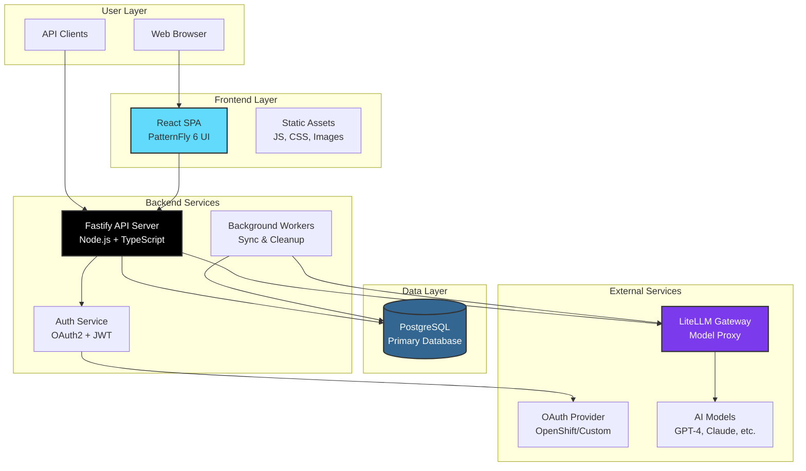
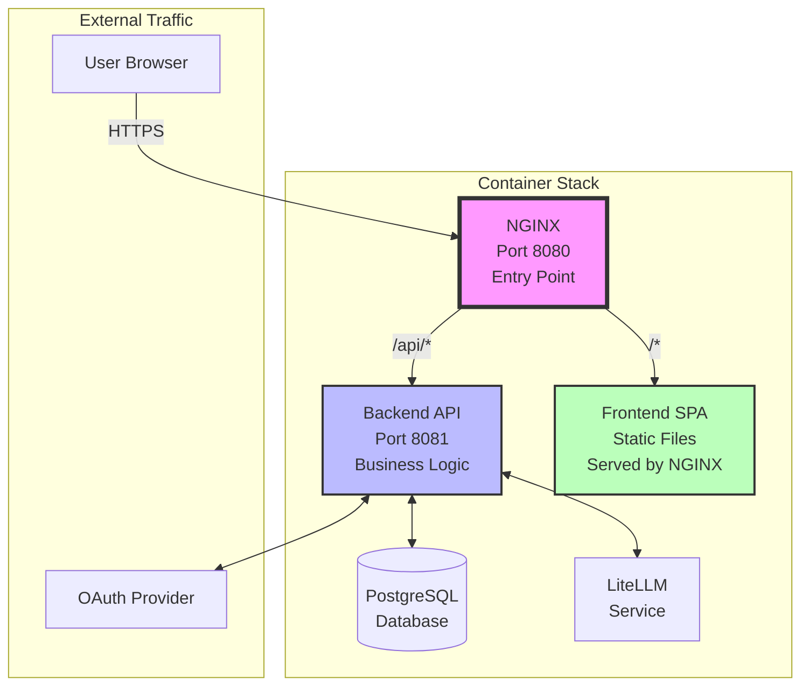
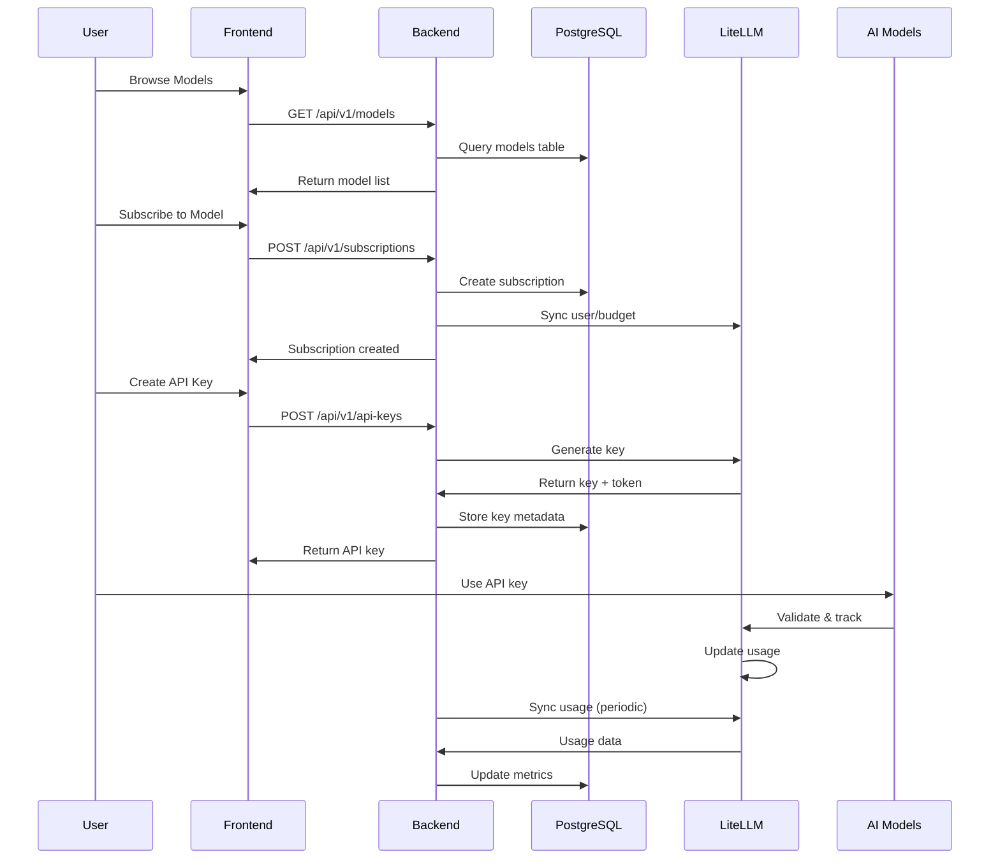
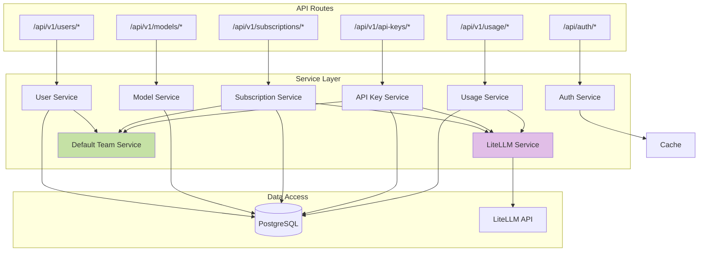
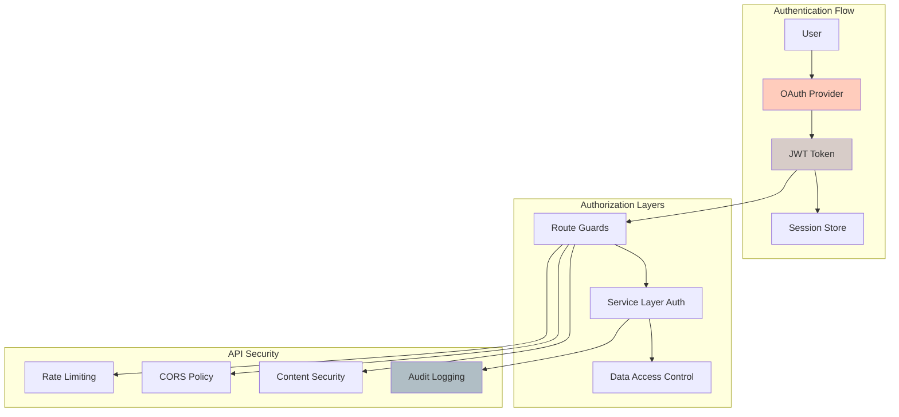
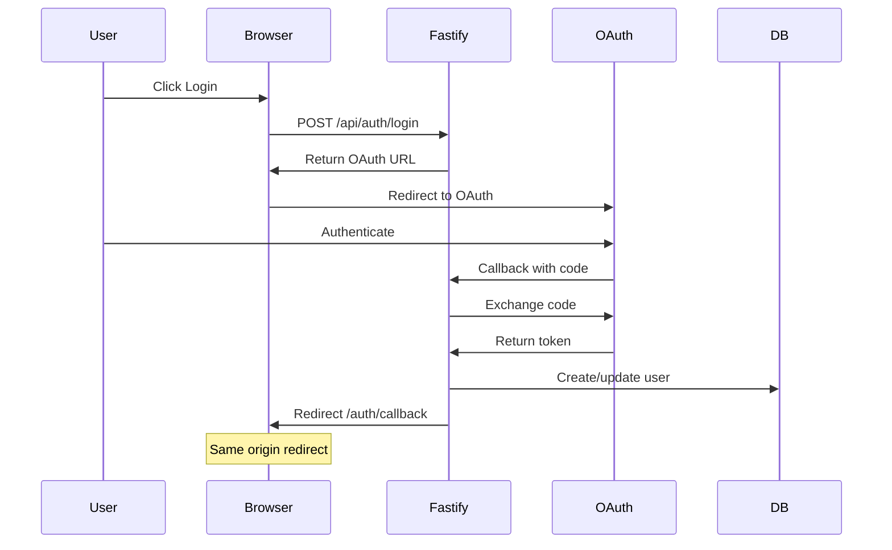
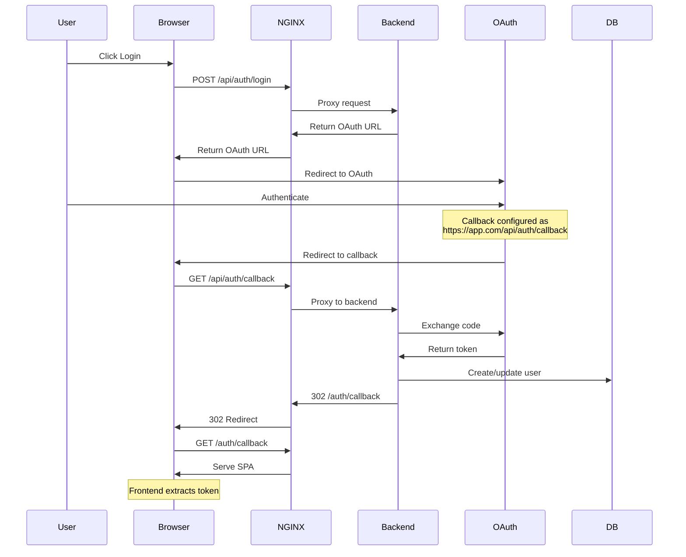

# System Architecture

## Overview

LiteMaaS follows a microservices architecture with clear separation between frontend and backend services, utilizing OAuth2 for authentication and deep integration with LiteLLM for model management, budget tracking, and usage analytics.

## High-Level Architecture



## Container Architecture

In production and containerized deployments, NGINX serves as the single entry point:



### Key Architectural Principles

1. **Single Entry Point**: NGINX handles all external traffic
2. **API Separation**: `/api/*` routes proxied to backend
3. **Static File Serving**: Frontend SPA served directly by NGINX
4. **Environment Agnostic**: Relative redirects enable deployment flexibility
5. **Secure by Default**: No direct backend exposure

## Component Details

### Frontend (React + PatternFly)

- **Purpose**: User interface for model discovery, subscription, and usage monitoring
- **Technology**: React 18, TypeScript, PatternFly 6, Vite
- **Key Features**:
  - SPA with client-side routing
  - OAuth integration for authentication
  - Real-time usage statistics
  - Responsive design

### Backend (Fastify)

- **Purpose**: API server handling business logic and LiteLLM integration
- **Technology**: Fastify, TypeScript, Node.js
- **Key Features**:
  - RESTful API with OpenAPI documentation
  - JWT-based authentication
  - Multi-level budget and rate limiting
  - Bidirectional LiteLLM synchronization
  - Team management and collaboration
  - Real-time cost tracking and analytics

### Database (PostgreSQL)

- **Purpose**: Persistent storage for user data, teams, subscriptions, and cost analytics
- **Schema**: Users, Teams, Subscriptions, API Keys, Usage Metrics with Cost Tracking
- **Features**:
  - Transaction support
  - JSON data types for flexible model metadata
  - Partitioned tables for high-volume usage logs
  - LiteLLM synchronization metadata
  - Multi-level budget and spend tracking
  - Indexes for performance

### External Services

#### OpenShift OAuth Provider

- **Purpose**: Enterprise authentication
- **Integration**: OAuth 2.0 flow
- **User Info**: Retrieves user profile and groups

#### LiteLLM Instance

- **Purpose**: AI model proxy with budget management
- **Integration**: Bidirectional REST API synchronization
- **Features**:
  - Model listing and metadata
  - Completion requests with cost tracking
  - User and team budget management
  - Rate limiting (TPM/RPM)
  - API key generation and management
  - Real-time usage analytics

## Data Flow Architecture



## Service Layer Architecture



## Security Architecture



### Budget Management Hierarchy

```
Organization Level
├── Team Budgets (shared across team members)
│   ├── User Budgets (individual limits within team)
│   └── Subscription Budgets (per-model limits)
│       └── API Key Budgets (granular access control)
```

### Data Flow Architecture

1. **User Actions** → LiteMaaS API → Database Updates
2. **Sync Process** → LiteLLM API Updates → Bidirectional Synchronization
3. **Usage Events** → LiteLLM → Usage Logs → Cost Calculation
4. **Budget Monitoring** → Real-time Alerts → Automated Actions

## OAuth Authentication Flow

The OAuth flow is central to LiteMaaS security and works differently in development vs containerized environments:

### Development Environment Flow



### Container/Production Flow



### OAuth Configuration Requirements

| Component      | Configuration                                | Purpose                                |
| -------------- | -------------------------------------------- | -------------------------------------- |
| OAuth Provider | Redirect URI: `<base-url>/api/auth/callback` | Where to send user after auth          |
| Backend        | `OAUTH_CALLBACK_URL` env var                 | Validate OAuth responses               |
| Backend        | Relative redirect: `/auth/callback`          | Environment-agnostic frontend redirect |
| NGINX          | Proxy `/api/*` to backend                    | Route OAuth callbacks correctly        |
| Frontend       | Handle `/auth/callback` route                | Extract and store JWT token            |

## Security Architecture

### Authentication Flow

```
User → Frontend → OAuth Redirect → OpenShift → Callback → Backend → JWT → Frontend
```

### API Security

- JWT tokens for API authentication
- Rate limiting per user/API key
- CORS configuration
- Helmet.js for security headers
- Input validation with JSON Schema

### Data Security

- Encryption at rest (PostgreSQL)
- Encryption in transit (TLS)
- Sensitive data masking in logs
- API key hashing

## Deployment Architecture

### Kubernetes/OpenShift

```
Namespace: litemaas
├── Deployments
│   ├── frontend (3 replicas)
│   ├── backend (3 replicas)
├── Services
│   ├── frontend-svc
│   ├── backend-svc
├── Routes/Ingress
│   ├── app.litemaas.com → frontend
│   └── api.litemaas.com → backend
├── ConfigMaps
│   ├── frontend-config
│   └── backend-config
└── Secrets
    ├── oauth-credentials
    ├── jwt-secret
    └── database-credentials
```

## Scalability Considerations

### Horizontal Scaling

- Stateless backend services
- Database connection pooling
- Load balancing via OpenShift

### Performance Optimization

- Frontend: Code splitting, lazy loading
- Backend: Response caching, query optimization
- Database: Indexes, partitioning for metrics
- CDN for static assets

## Monitoring & Observability

### Metrics (Prometheus)

- Application metrics (response times, error rates)
- Business metrics (subscriptions, API usage)
- Infrastructure metrics (CPU, memory, disk)

### Logging (ELK Stack)

- Structured JSON logging
- Request/response logging
- Error tracking
- Audit trails

### Tracing (Jaeger)

- Distributed request tracing
- Performance bottleneck identification
- Service dependency mapping

## Disaster Recovery

### Backup Strategy

- Database: Daily automated backups
- Configuration: Version controlled
- Secrets: Encrypted backups

### High Availability

- Multi-zone deployment
- Database replication
- Health checks and auto-recovery
