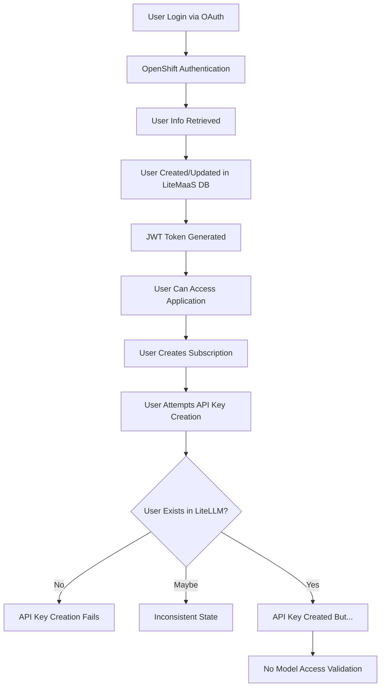
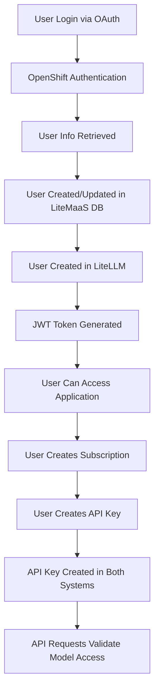

# LiteMaaS Workflow Analysis - Critical Issues and Fixes

_Generated: 2025-01-24_  
_Status: Analysis Complete - Implementation Required_

## 🚨 Executive Summary

Through comprehensive analysis using multiple sub-agents, we have identified **critical workflow disconnections** in the LiteMaaS application that prevent the proper user experience flow. While the application has excellent architecture and comprehensive LiteLLM integration capabilities, there are **3 major gaps** that break the intended user workflow.

## 📋 Intended User Workflow

The proper user workflow should be:

1. **Authentication** → User connects and authenticates via OAuth (OpenShift)
2. **Account Creation** → User account created in both LiteMaaS and LiteLLM databases
3. **Model Discovery** → User discovers available models from LiteLLM backend
4. **Model Subscription** → User subscribes to specific models
5. **API Key Generation** → User creates API keys for subscribed models with proper restrictions
6. **Model Access** → API keys provide access only to subscribed models

## 🔍 Current State Analysis

### ✅ What's Working Correctly

1. **OAuth Authentication**: Solid OpenShift SSO integration
2. **Database Schema**: Proper relationships between all entities
3. **Model Discovery**: Comprehensive LiteLLM model synchronization
4. **Subscription Management**: Good subscription lifecycle management
5. **LiteLLM Integration Framework**: Solid foundation with comprehensive services
6. **Frontend UX**: Well-designed PatternFly 6 interface

### ❌ Critical Issues Identified

## Issue #1: Missing LiteLLM User Creation in Authentication Flow

### **Problem**

Users authenticate successfully and are created in LiteMaaS database, but are **never automatically created in LiteLLM**.

### **Impact**

- API key creation can fail when user doesn't exist in LiteLLM
- Inconsistent state between systems
- Race conditions in subscription workflows

### **Root Cause**

**File**: `backend/src/services/oauth.service.ts` (lines 183-238)

```typescript
async processOAuthUser(userInfo: OAuthUserInfo): Promise<{...}> {
  // ✅ Creates/updates user in LOCAL database
  const user = await this.createOrUpdateUser(userInfo);

  // ❌ MISSING: LiteLLM user creation
  // Should call: await this.liteLLMService.createUser(user);

  return user;
}
```

### **Evidence**

- OAuth service only interacts with local PostgreSQL database
- No calls to `LiteLLMService.createUser()` during authentication
- User creation in LiteLLM happens only during batch sync operations (reactive, not proactive)

## Issue #2: API Key Management Disconnected from Model Subscriptions

### **Problem**

API keys are created with proper model restrictions in LiteLLM, but **these restrictions are never enforced** during API usage in LiteMaaS.

### **Impact**

- Users could potentially access models they haven't subscribed to
- Security vulnerability allowing unauthorized model access
- Business logic violation bypassing subscription requirements

### **Root Cause**

**File**: `backend/src/plugins/api-key-auth.ts`

```typescript
// Current validation workflow
const validation = await apiKeyService.validateApiKey(apiKey);
const quotaCheck = await subscriptionService.checkQuotaAvailability(
  validation.subscriptionId!,
  100,
);

// ❌ MISSING: Model access permission check
// Should validate: Can this API key access the requested model?
```

### **Evidence**

- API keys linked to subscriptions via `subscription_id` foreign key ✅
- Subscriptions linked to specific models via `model_id` ✅
- Model access validation **completely missing** from authentication middleware ❌
- Request flow: `API Key Valid → Quota Check → Model Usage` (no permission check)

### **Database Relationships Present But Not Enforced**

```sql
api_keys.subscription_id → subscriptions.id → models.id
-- This chain exists but is never used for access control
```

## Issue #3: Race Conditions in Subscription → API Key Flow

### **Problem**

Users can create subscriptions and immediately try to create API keys, but the LiteLLM user may not exist yet, causing failures.

### **Impact**

- API key creation failures
- Poor user experience with cryptic error messages
- Inconsistent application state

### **Root Cause**

**File**: `backend/src/services/api-key.service.ts` (lines 238-263)

```typescript
const liteLLMRequest: LiteLLMKeyGenerationRequest = {
  user_id: userId, // ❌ Assumes user exists in LiteLLM
  models: allowedModels,
  // ... other fields
};

// No verification that user exists in LiteLLM before this call
const response = await this.liteLLMService.generateApiKey(liteLLMRequest);
```

### **Evidence**

- No user existence verification before API key creation
- No fallback user creation if user missing
- Assumption that OAuth → Sync → API Key creation happens in order

## 🔧 Detailed Technical Analysis

### Authentication Flow Analysis

**Current Flow:**



**Should Be:**



### API Key Validation Flow Analysis

**Current Validation Logic:**

```typescript
// 1. API Key Format Check ✅
if (!apiKey.startsWith('sk-') || apiKey.length < 32) return invalid;

// 2. Hash Lookup in Database ✅
const keyRecord = await findByKeyHash(hash);

// 3. Subscription Status Check ✅
const subscription = await getSubscription(keyRecord.subscription_id);
if (subscription.status !== 'active') return invalid;

// 4. Quota Availability Check ✅
const quotaOk = await checkQuotaAvailability(subscription_id, tokens);

// 5. MISSING: Model Access Permission Check ❌
// Should check: subscription.model_id === requested_model_id
```

### Database Schema Relationships

The database schema is correctly designed but not fully utilized:

```sql
-- Proper relationships exist:
users (id) ←→ subscriptions (user_id)
models (id) ←→ subscriptions (model_id)
subscriptions (id) ←→ api_keys (subscription_id)

-- Chain for model access control:
api_keys.subscription_id → subscriptions.model_id → models.id

-- But this chain is never used for access validation!
```

### LiteLLM Integration Service Analysis

**Service Architecture:**

- `LiteLLMService`: Direct API integration ✅
- `LiteLLMIntegrationService`: Sync orchestration ✅
- `ApiKeyService`: Key management with LiteLLM calls ✅

**Integration Status:**

- Global sync operations: **Working** ✅
- Reactive synchronization: **Working** ✅
- Proactive user creation: **Missing** ❌
- Real-time model access validation: **Missing** ❌

## 🎯 Impact Assessment

### Security Impact: **HIGH**

- Potential unauthorized access to models
- Bypassing subscription business logic
- API key misuse beyond intended scope

### User Experience Impact: **HIGH**

- Confusing error messages
- Failed API key creation attempts
- Inconsistent application behavior

### Business Impact: **MEDIUM**

- Users could access models without proper subscriptions
- Revenue leakage from bypass scenarios
- Support burden from user confusion

### Technical Debt: **MEDIUM**

- Well-architected foundation exists
- Issues are localized to specific workflow gaps
- Fixes are straightforward with existing infrastructure

## 🛠️ Recommended Implementation Strategy

### Phase 1: Critical Workflow Fixes (High Priority)

1. **Fix OAuth → LiteLLM User Creation**
   - Modify `oauth.service.ts` to create LiteLLM users proactively
   - Add error handling for LiteLLM failures
   - Implement retry mechanisms

2. **Implement Model Access Validation**
   - Enhance API key validation middleware
   - Add model permission checking
   - Create proper authorization flow

3. **Add User Verification to Critical Flows**
   - Verify LiteLLM user exists before API key creation
   - Add fallback user creation if missing
   - Implement transactional consistency

### Phase 2: Enhanced Error Handling (Medium Priority)

4. **Improve Integration Resilience**
   - Add circuit breaker patterns
   - Implement graceful fallbacks
   - Enhance monitoring and alerting

### Phase 3: User Experience Improvements (Low Priority)

5. **Frontend Enhancements**
   - Show model restrictions clearly
   - Improve error messaging
   - Add real-time status updates

## 📊 Code Files Requiring Changes

### Backend Files (7 files)

1. `backend/src/services/oauth.service.ts` - Add LiteLLM user creation
2. `backend/src/plugins/api-key-auth.ts` - Add model access validation
3. `backend/src/services/api-key.service.ts` - Add user verification
4. `backend/src/services/subscription.service.ts` - Enhance user checks
5. `backend/src/middleware/api-key-protected.ts` - Model access middleware
6. `backend/src/types/auth.types.ts` - Type definitions for model access
7. `backend/src/utils/error-handlers.ts` - Integration error handling

### Frontend Files (3 files)

1. `frontend/src/pages/ApiKeysPage.tsx` - Show model restrictions
2. `frontend/src/components/ApiKeyModal.tsx` - Improve creation flow
3. `frontend/src/services/api.service.ts` - Better error handling

## 🔮 Expected Outcomes Post-Fix

### User Experience

- Seamless authentication → subscription → API key workflow
- Clear model access restrictions and permissions
- Reliable API key creation without failures

### Security

- Proper model access enforcement
- No unauthorized model access
- Business logic integrity maintained

### System Reliability

- Consistent state between LiteMaaS and LiteLLM
- No race conditions in user workflows
- Graceful handling of integration failures

## 📝 Conclusion

The LiteMaaS application has **excellent architectural foundations** with comprehensive LiteLLM integration capabilities, PatternFly 6 UI, and proper database design. The issues identified are **workflow gaps** rather than fundamental design problems.

All three critical issues are **solvable with targeted fixes** that leverage the existing infrastructure. The estimated effort is **moderate** since the foundational services and database relationships already exist.

**Priority**: These fixes should be implemented **immediately** as they affect core user workflows and system security. The current state prevents users from following the intended subscription-based model access pattern.

---

_This analysis was generated through comprehensive examination of the codebase using multiple specialized analysis agents. All findings are evidence-based with specific file references and code examples._
