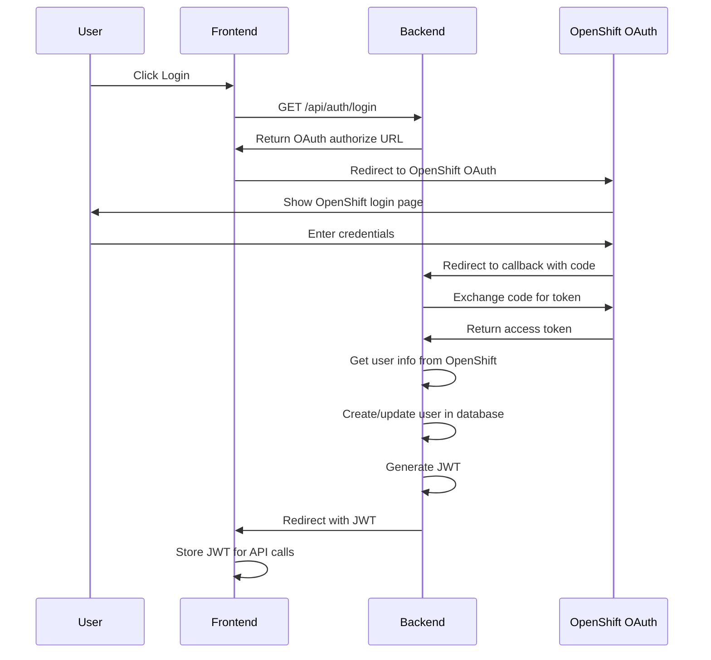

# Production Mode Configuration Guide

This guide explains how to configure and run LiteMaaS in production mode with OpenShift OAuth authentication.

## OpenShift OAuth Configuration

### 1. Register OAuth Client in OpenShift

Create an OAuth client in your OpenShift cluster:

```yaml
apiVersion: oauth.openshift.io/v1
kind: OAuthClient
metadata:
  name: litemaas-client
secret: <generate-secure-secret>
redirectURIs:
  - https://<your-production-domain>/api/auth/callback
  - http://localhost:8081/api/auth/callback # For local testing
grantMethod: auto
```

Apply the configuration:

```bash
oc apply -f oauth-client.yaml
```

### 2. Configure Environment Variables

Set the following environment variables for production:

```bash
# OpenShift OAuth Configuration (REQUIRED)
OAUTH_CLIENT_ID=litemaas-client
OAUTH_CLIENT_SECRET=<your-secure-secret>
OAUTH_ISSUER=https://<your-openshift-api-server>:6443
OAUTH_CALLBACK_URL=https://<your-production-domain>/api/auth/callback

# Disable Mock Authentication (IMPORTANT)
OAUTH_MOCK_ENABLED=false
NODE_ENV=production

# JWT Configuration
JWT_SECRET=<generate-strong-secret>
JWT_EXPIRES_IN=24h

# Admin API Keys (for system access)
ADMIN_API_KEYS=<comma-separated-strong-keys>
```

### 3. OpenShift Group to Role Mapping

Configure how OpenShift groups map to application roles:

- `litemaas-admins` → `admin` role
- `litemaas-users` → `user` role
- `litemaas-readonly` → `readonly` role

Users must be members of at least one of these groups to access the application.

## Running in Production Mode

```bash
# Run in production mode with proper OAuth
NODE_ENV=production npm run dev
```

## Authentication Behavior

### Development Mode (`NODE_ENV=development`)

- ✅ Mock OAuth authentication with test users
- ✅ Frontend requests bypass authentication (localhost origins)
- ✅ Swagger docs accessible with logging
- ✅ Development endpoints available
- 📝 All access logged for security monitoring

### Production Mode (`NODE_ENV=production`)

- 🔒 OpenShift OAuth authentication required
- 🔒 Swagger docs require authentication (admin API key or JWT token)
- 🔒 No frontend bypass - proper OAuth flow required
- 🚫 Mock authentication disabled
- 🚫 Development endpoints hidden

## OAuth Authentication Flow

### 1. User Login Flow



### 2. API Authentication

All API requests in production must include a valid JWT token:

```typescript
// Frontend API client configuration
const apiClient = axios.create({
  baseURL: '/api',
  headers: {
    Authorization: `Bearer ${getStoredJWT()}`,
  },
});
```

### 3. Admin Access

For system-level access without OAuth:

```bash
# Use admin API key for system operations
curl -H "Authorization: Bearer ${ADMIN_API_KEY}" \
  https://litemaas.example.com/api/models/sync
```

## Security Considerations

### 1. Production Security Checklist

- [ ] OpenShift OAuth client properly configured
- [ ] Strong OAuth client secret generated
- [ ] JWT secret is strong and unique
- [ ] Admin API keys are strong and rotated regularly
- [ ] HTTPS/TLS enabled for all connections
- [ ] CORS configured for production domain only
- [ ] Rate limiting enabled
- [ ] Audit logging configured

### 2. Required OpenShift Permissions

Ensure the service account has permissions to:

- Read user information: `user:info`
- Check user access: `user:check-access`
- List user groups: `user:list-scoped`

### 3. Troubleshooting OAuth Issues

#### Common Issues:

**OAuth callback fails:**

- Verify redirect URI matches exactly in OpenShift OAuth client
- Check OAUTH_CALLBACK_URL environment variable
- Ensure network connectivity between app and OpenShift API

**User info retrieval fails:**

- Verify OAUTH_ISSUER points to correct OpenShift API server
- Check token has required scopes
- Ensure user has proper OpenShift groups

**JWT generation fails:**

- Verify JWT_SECRET is set
- Check user has required groups for role mapping
- Review backend logs for specific errors

## Testing Production Configuration

### 1. Test OAuth Login Flow

```bash
# Test OAuth login endpoint
curl -i https://litemaas.example.com/api/auth/login

# Should return redirect to OpenShift OAuth:
# HTTP/302 Found
# Location: https://oauth.openshift.com/oauth/authorize?client_id=...
```

### 2. Test API Authentication

```bash
# Test without auth (should fail with 401)
curl -i https://litemaas.example.com/api/subscriptions

# Test with valid JWT (should succeed)
curl -H "Authorization: Bearer ${JWT_TOKEN}" \
  https://litemaas.example.com/api/subscriptions

# Test with admin API key (should succeed)
curl -H "Authorization: Bearer ${ADMIN_API_KEY}" \
  https://litemaas.example.com/api/subscriptions
```

### 3. Verify Mock Mode is Disabled

```bash
# This should fail in production
curl -X POST https://litemaas.example.com/api/auth/dev-token \
  -H "Content-Type: application/json" \
  -d '{"username": "test"}'
# Expected: 404 Not Found
```

## Security Features by Mode

| Feature             | Development    | Production            | Notes                             |
| ------------------- | -------------- | --------------------- | --------------------------------- |
| OAuth Provider      | Mock users     | OpenShift OAuth       | Real authentication in production |
| Frontend Bypass     | ✅ Enabled     | 🚫 Disabled           | No bypass in production           |
| Mock Authentication | ✅ Enabled     | 🚫 Disabled           | `OAUTH_MOCK_ENABLED=false`        |
| Swagger Access      | ✅ Open        | 🔒 Admin/JWT required | Requires authentication           |
| Dev Token Endpoint  | ✅ Available   | 🚫 Hidden             | Not available in production       |
| Admin API Keys      | ✅ Full access | ✅ Full access        | System operations only            |
| User API Keys       | ✅ Validated   | ✅ Validated          | Full LiteLLM integration          |
| Security Logging    | 📝 Debug       | ⚠️ Warning            | Enhanced monitoring               |

---

**Important**: This guide ensures that LiteMaaS uses OpenShift OAuth authentication in production mode. The development mode provides mock authentication for easier testing, while production mode enforces real OpenShift authentication with no bypasses.
