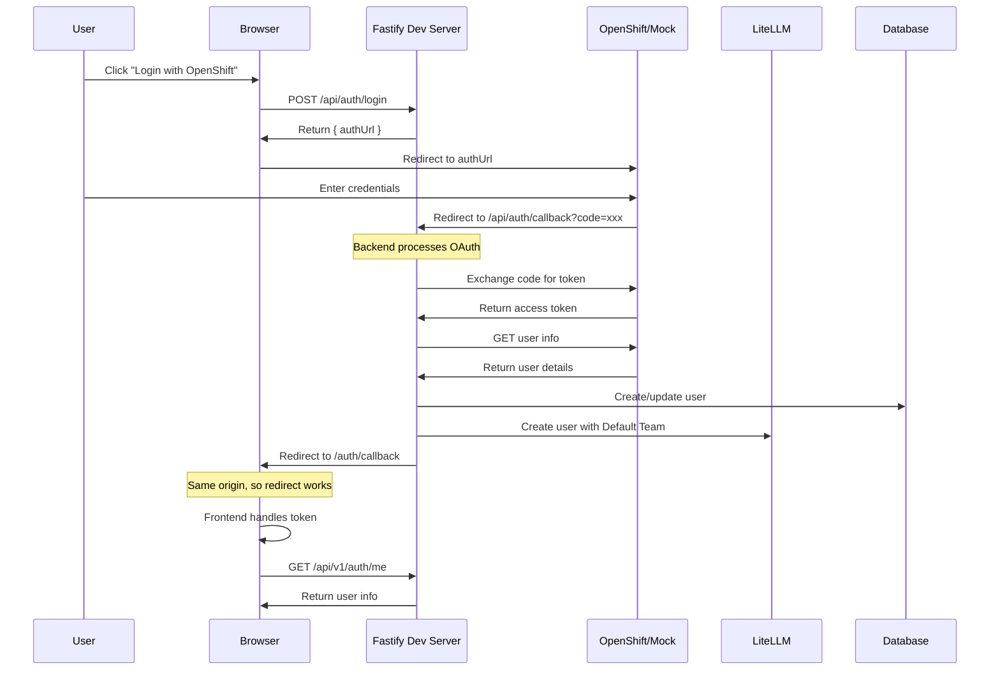
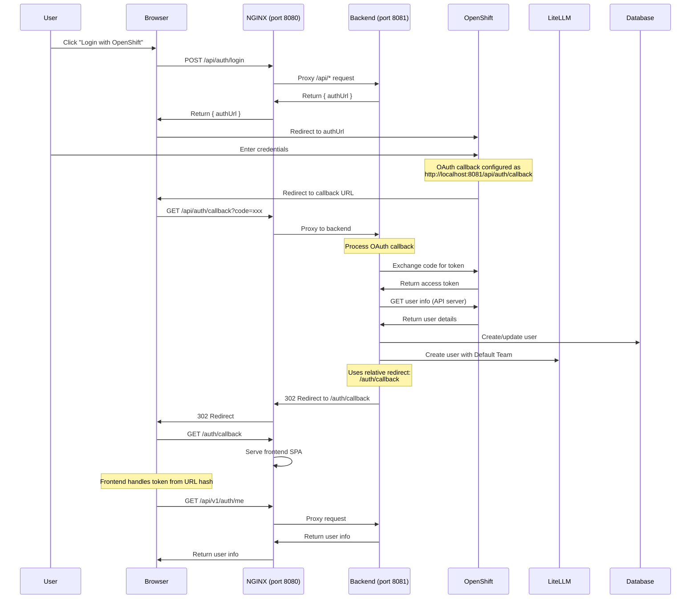

# Authentication Flow Implementation

**Last Updated**: 2025-08-04 - Updated with simplified user ID management and LiteLLM integration

## Overview

LiteMaaS implements a comprehensive authentication system that supports OAuth 2.0 (primarily OpenShift) for production environments while providing a convenient mock mode for development. The system automatically provisions users in both the local database and LiteLLM proxy service.

## Architecture

### API Endpoint Organization

The authentication endpoints are strategically split into two categories:

1. **OAuth Flow Endpoints** (`/api/auth/*`)
   - Unversioned to maintain compatibility with OAuth provider configuration
   - Handle the OAuth authentication flow
   - Endpoints: `/login`, `/callback`, `/logout`, `/validate`

2. **User Profile Endpoints** (`/api/v1/auth/*`)
   - Versioned as part of the business API
   - Provide authenticated user information
   - Endpoints: `/me`, `/profile`

### Why This Split?

- **OAuth Provider Compatibility**: OAuth redirect URIs are registered with the provider and changing them requires reconfiguration
- **API Versioning**: User profile endpoints are business logic that may evolve with the API
- **Clear Separation**: Authentication flow vs. authenticated operations

## OAuth Flow Sequence

### Development Mode (Single Process)

In development, both frontend and backend are served by the same Fastify process:



### Container/Production Mode (NGINX + Backend)

In containerized deployments, NGINX serves as the single entry point:



### Key Differences Between Environments

1. **Development Mode**:
   - Single Fastify process serves both frontend and backend
   - Direct communication, no proxy needed
   - OAuth callback URL: `http://localhost:8081/api/auth/callback`

2. **Container/Production Mode**:
   - NGINX as single entry point (port 8080)
   - Backend runs separately (port 8081)
   - NGINX proxies `/api/*` requests to backend
   - OAuth callback URL: `<base-url>/api/auth/callback`
   - Backend uses relative redirects to work in any environment

### OAuth Callback URL Configuration (Updated)

As of the latest update, LiteMaaS implements intelligent OAuth callback URL handling:

#### Automatic Detection and State Preservation

1. **Authorization Phase**: The backend automatically detects the appropriate callback URL based on the request origin and stores it with the OAuth state parameter
2. **Token Exchange Phase**: The stored callback URL is retrieved and reused to ensure OAuth 2.0 compliance (redirect_uri must match exactly)
3. **Fallback Support**: The `OAUTH_CALLBACK_URL` environment variable serves as a fallback when automatic detection is not possible

#### Multiple Callback URLs

Register ALL possible callback URLs with your OAuth provider:

| Environment          | Callback URLs to Register                                                              | Notes                         |
| -------------------- | -------------------------------------------------------------------------------------- | ----------------------------- |
| Development (Vite)   | `http://localhost:3000/api/auth/callback`                                              | Vite dev server on port 3000  |
| Development (Direct) | `http://localhost:8081/api/auth/callback`<br>`http://localhost:8081/api/auth/callback` | Direct backend access         |
| Container (NGINX)    | `http://localhost:8081/api/auth/callback`                                              | NGINX on port 8080            |
| Production           | `https://your-domain.com/api/auth/callback`                                            | Through ingress/load balancer |

The application will automatically select the correct callback URL based on the request origin. The backend's relative redirect (`/auth/callback`) ensures the browser is redirected to the correct frontend route regardless of the deployment environment.

## Key Implementation Details

### 1. OpenShift Integration

The OAuth service correctly handles OpenShift's dual-endpoint architecture:

```typescript
// OAuth server for authentication
const oauthServer = 'https://oauth-openshift.apps.cluster.com';

// API server for user information
const apiServer = 'https://api.cluster.com:6443';

// User info endpoint
const userInfoUrl = `${apiServer}/apis/user.openshift.io/v1/users/~`;
```

### 2. User Creation Flow (Updated 2025-07-30)

When a user logs in for the first time, the comprehensive default team implementation ensures proper integration:

#### Step-by-Step Process

1. **OAuth callback receives user information from OpenShift**
2. **Default Team Existence Check**: `await this.defaultTeamService.ensureDefaultTeamExists()`
   - Creates default team in database if not exists
   - Creates default team in LiteLLM if not exists
   - Uses empty models array for all-model access
3. **User Database Operations**:
   - Check if user exists in local database
   - Create or update user record
4. **LiteLLM Integration**:
   - Create user in LiteLLM with mandatory team assignment
   - Uses team-based user existence detection
   - Assigns `teams: [DefaultTeamService.DEFAULT_TEAM_ID]`
   - Applies configurable default values for budget and rate limits
5. **Team Membership**:
   - Assign user to Default Team in database
   - Verify team membership for future operations

#### Default Team Implementation Details

**OAuthService Implementation** (Line 321):

```typescript
// Ensure default team exists before user creation
await this.defaultTeamService.ensureDefaultTeamExists();

// User creation includes team assignment with configurable defaults
const liteLLMUser = await this.liteLLMService.createUser({
  user_id: user.id,
  user_alias: user.username,
  user_email: user.email,
  user_role: 'internal_user',
  max_budget: Number(this.fastify.config.DEFAULT_USER_MAX_BUDGET), // Configurable via env var
  tpm_limit: Number(this.fastify.config.DEFAULT_USER_TPM_LIMIT), // Configurable via env var
  rpm_limit: Number(this.fastify.config.DEFAULT_USER_RPM_LIMIT), // Configurable via env var
  teams: [DefaultTeamService.DEFAULT_TEAM_ID], // CRITICAL: Always assign user to default team
});
```

**Configuration**: The default values (`DEFAULT_USER_MAX_BUDGET`, `DEFAULT_USER_TPM_LIMIT`, `DEFAULT_USER_RPM_LIMIT`) can be customized via environment variables. See [Configuration Guide](../deployment/configuration.md#default-user-values) for details.

#### Error Handling (Fully Implemented 2025-07-30)

**Issue**: API key and subscription creation was failing when users already existed in LiteLLM from OAuth flow.

**Comprehensive Solution**: Standardized error handling and user existence detection across ALL services:

1. **OAuth Service**: ✅ Handles "already exists" errors gracefully
2. **API Key Service**: ✅ Added proper error handling for existing users
3. **Subscription Service**: ✅ Fixed to use check-first pattern instead of try/catch
4. **LiteLLM Integration Service**: ✅ Added team-based user existence detection in bulk sync
5. **LiteLLM Service**: ✅ Fixed mock responses to use empty models arrays

**Standard Pattern**:

1. Ensure default team exists first
2. Check user existence via team membership (not HTTP status)
3. Create if needed with team assignment
4. Handle "already exists" as success

#### User Existence Detection Fix

**Before**: Unreliable HTTP status checking

```typescript
// ❌ Always returned HTTP 200, even for non-existent users
const response = await this.liteLLMService.getUserInfo(userId);
// Would always succeed, causing false positives
```

**After**: Team-based validation

```typescript
// ✅ Check teams array for actual existence
const response = await this.liteLLMService.getUserInfo(userId);
if (!response.teams || response.teams.length === 0) {
  return null; // User doesn't exist in LiteLLM
}
```

### 3. Schema Validation

Different endpoints use different schemas to match frontend expectations:

- `/api/v1/auth/me`: Returns `UserInfoSchema` with `name` field
- `/api/v1/auth/profile`: Returns `UserProfileSchema` with `fullName` and `createdAt`

### 4. Error Handling

Enhanced error handling throughout the flow:

- OAuth state validation to prevent CSRF
- Graceful handling of existing users in LiteLLM
- Detailed logging for troubleshooting
- User-friendly error messages

## Development Mode

### Mock OAuth Provider

In development, a mock OAuth provider simulates OpenShift:

```typescript
const MOCK_USERS = [
  {
    id: 'admin-001',
    username: 'admin@example.com',
    fullName: 'System Administrator',
    roles: ['admin', 'user'],
  },
  {
    id: 'user-001',
    username: 'user@example.com',
    fullName: 'Regular User',
    roles: ['user'],
  },
  {
    id: 'readonly-001',
    username: 'readonly@example.com',
    fullName: 'Read Only User',
    roles: ['readonly'],
  },
];
```

### Enabling Mock Mode

Set environment variable:

```env
OAUTH_MOCK_ENABLED=true
```

## Security Considerations

1. **State Parameter**: Prevents CSRF attacks during OAuth flow
2. **JWT Tokens**: Short-lived tokens with proper expiration
3. **Secure Storage**: Tokens stored securely in frontend
4. **HTTPS Required**: Production must use HTTPS for all endpoints
5. **Audit Logging**: All authentication events are logged
6. **Token Age for Sensitive Operations**:
   - Currently set to 24 hours for API key retrieval operations
   - **TODO**: This is temporarily relaxed from 5 minutes for better UX
   - Consider implementing a more granular approach based on operation sensitivity
   - For example: 5 minutes for key retrieval, 1 hour for key creation, 24 hours for viewing

## Configuration

### Environment Variables

```env
# OAuth Configuration
OAUTH_CLIENT_ID=litemaas
OAUTH_CLIENT_SECRET=your-secret-here
OAUTH_ISSUER=https://oauth-openshift.apps.cluster.com
OAUTH_CALLBACK_URL=http://localhost:8081/api/auth/callback

# Development
OAUTH_MOCK_ENABLED=true  # Set to false for production

# JWT Configuration
JWT_SECRET=your-jwt-secret
JWT_EXPIRES_IN=24h
```

### OpenShift OAuth Client

Register all possible callback URLs to support different environments:

```yaml
apiVersion: oauth.openshift.io/v1
kind: OAuthClient
metadata:
  name: litemaas
secret: your-secret-here
redirectURIs:
  - http://localhost:3000/api/auth/callback # Development (Vite)
  - http://localhost:8081/api/auth/callback # Development (Direct) / Container
  - http://localhost:8081/api/auth/callback # Backend Direct Access
  - https://your-domain/api/auth/callback # Production
grantMethod: prompt
```

The application will automatically select the appropriate callback URL based on where the request originates from.

## Frontend Integration

### Auth Context

The frontend AuthContext handles:

- Login initiation
- Token storage
- User state management
- Automatic token inclusion in API requests

### Auth Service

Updated to use correct endpoints:

- `/api/auth/login` for OAuth initiation
- `/api/auth/logout` for logout
- `/api/v1/auth/me` for user information

## Testing

### Manual Testing

1. **Mock OAuth Flow**:

   ```bash
   # Set OAUTH_MOCK_ENABLED=true
   # Click login, select mock user
   ```

2. **Real OAuth Flow**:
   ```bash
   # Set OAUTH_MOCK_ENABLED=false
   # Configure OAuth client in OpenShift
   # Click login, authenticate with OpenShift
   ```

### Automated Testing

- Unit tests for OAuth service methods
- Integration tests for complete flow
- E2E tests for user journey

## Troubleshooting

### Common Issues

1. **"createdAt" is required!**
   - Fixed by using separate schemas for `/me` and `/profile` endpoints

2. **Failed to get user information**
   - Ensure OAuth server URL is converted to API server URL for user info

3. **User already exists in LiteLLM**
   - Handled gracefully, continues with existing user

4. **Wrong endpoint called**
   - Frontend updated to use `/api/v1/auth/me` instead of `/api/auth/me`

## Future Enhancements

1. **Refresh Tokens**: Implement token refresh mechanism
2. **Session Management**: Add session timeout and renewal
3. **Multi-Factor Authentication**: Support for 2FA
4. **Role-Based Access Control**: Fine-grained permissions based on OpenShift groups
