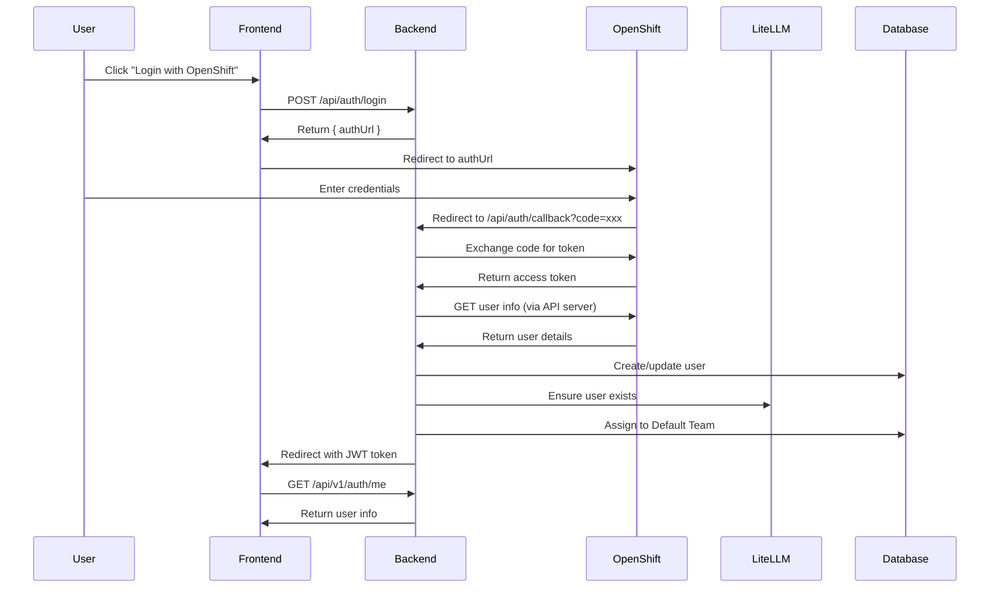

# Authentication Flow Implementation

**Last Updated**: 2025-01-30

## Overview

LiteMaaS implements a comprehensive authentication system that supports OpenShift OAuth 2.0 for production environments while providing a convenient mock mode for development.

## Architecture

### API Endpoint Organization

The authentication endpoints are strategically split into two categories:

1. **OAuth Flow Endpoints** (`/api/auth/*`)
   - Unversioned to maintain compatibility with OAuth provider configuration
   - Handle the OAuth authentication flow
   - Endpoints: `/login`, `/callback`, `/logout`, `/validate`

2. **User Profile Endpoints** (`/api/v1/auth/*`)
   - Versioned as part of the business API
   - Provide authenticated user information
   - Endpoints: `/me`, `/profile`

### Why This Split?

- **OAuth Provider Compatibility**: OAuth redirect URIs are registered with the provider and changing them requires reconfiguration
- **API Versioning**: User profile endpoints are business logic that may evolve with the API
- **Clear Separation**: Authentication flow vs. authenticated operations

## OAuth Flow Sequence



## Key Implementation Details

### 1. OpenShift Integration

The OAuth service correctly handles OpenShift's dual-endpoint architecture:

```typescript
// OAuth server for authentication
const oauthServer = "https://oauth-openshift.apps.cluster.com"

// API server for user information
const apiServer = "https://api.cluster.com:6443"

// User info endpoint
const userInfoUrl = `${apiServer}/apis/user.openshift.io/v1/users/~`
```

### 2. User Creation Flow

When a user logs in for the first time:

1. OAuth callback receives user information from OpenShift
2. System checks if user exists in local database
3. If new user:
   - Create user in local database
   - Create user in LiteLLM with Default Team
   - Assign user to Default Team in database
4. If existing user:
   - Update user information
   - Ensure LiteLLM user exists
   - Verify Default Team membership

#### Error Handling (Fixed 2025-07-30)

**Issue**: API key and subscription creation was failing when users already existed in LiteLLM from OAuth flow.

**Solution**: Standardized error handling across all services:
- OAuth Service: Already handled "already exists" errors gracefully
- API Key Service: Added proper error handling for existing users
- Subscription Service: Fixed to use check-first pattern instead of try/catch

**Pattern**: Check existence first, create if needed, handle "already exists" as success.

### 3. Schema Validation

Different endpoints use different schemas to match frontend expectations:

- `/api/v1/auth/me`: Returns `UserInfoSchema` with `name` field
- `/api/v1/auth/profile`: Returns `UserProfileSchema` with `fullName` and `createdAt`

### 4. Error Handling

Enhanced error handling throughout the flow:

- OAuth state validation to prevent CSRF
- Graceful handling of existing users in LiteLLM
- Detailed logging for troubleshooting
- User-friendly error messages

## Development Mode

### Mock OAuth Provider

In development, a mock OAuth provider simulates OpenShift:

```typescript
const MOCK_USERS = [
  {
    id: 'admin-001',
    username: 'admin@example.com',
    fullName: 'System Administrator',
    roles: ['admin', 'user']
  },
  {
    id: 'user-001',
    username: 'user@example.com',
    fullName: 'Regular User',
    roles: ['user']
  },
  {
    id: 'readonly-001',
    username: 'readonly@example.com',
    fullName: 'Read Only User',
    roles: ['readonly']
  }
]
```

### Enabling Mock Mode

Set environment variable:
```env
OAUTH_MOCK_ENABLED=true
```

## Security Considerations

1. **State Parameter**: Prevents CSRF attacks during OAuth flow
2. **JWT Tokens**: Short-lived tokens with proper expiration
3. **Secure Storage**: Tokens stored securely in frontend
4. **HTTPS Required**: Production must use HTTPS for all endpoints
5. **Audit Logging**: All authentication events are logged

## Configuration

### Environment Variables

```env
# OAuth Configuration
OAUTH_CLIENT_ID=litemaas
OAUTH_CLIENT_SECRET=your-secret-here
OAUTH_ISSUER=https://oauth-openshift.apps.cluster.com
OAUTH_CALLBACK_URL=http://localhost:8080/api/auth/callback

# Development
OAUTH_MOCK_ENABLED=true  # Set to false for production

# JWT Configuration
JWT_SECRET=your-jwt-secret
JWT_EXPIRES_IN=24h
```

### OpenShift OAuth Client

```yaml
apiVersion: oauth.openshift.io/v1
kind: OAuthClient
metadata:
  name: litemaas
secret: your-secret-here
redirectURIs:
- http://localhost:8080/api/auth/callback      # Development
- https://your-domain/api/auth/callback        # Production
grantMethod: prompt
```

## Frontend Integration

### Auth Context

The frontend AuthContext handles:
- Login initiation
- Token storage
- User state management
- Automatic token inclusion in API requests

### Auth Service

Updated to use correct endpoints:
- `/api/auth/login` for OAuth initiation
- `/api/auth/logout` for logout
- `/api/v1/auth/me` for user information

## Testing

### Manual Testing

1. **Mock OAuth Flow**:
   ```bash
   # Set OAUTH_MOCK_ENABLED=true
   # Click login, select mock user
   ```

2. **Real OAuth Flow**:
   ```bash
   # Set OAUTH_MOCK_ENABLED=false
   # Configure OAuth client in OpenShift
   # Click login, authenticate with OpenShift
   ```

### Automated Testing

- Unit tests for OAuth service methods
- Integration tests for complete flow
- E2E tests for user journey

## Troubleshooting

### Common Issues

1. **"createdAt" is required!**
   - Fixed by using separate schemas for `/me` and `/profile` endpoints

2. **Failed to get user information**
   - Ensure OAuth server URL is converted to API server URL for user info

3. **User already exists in LiteLLM**
   - Handled gracefully, continues with existing user

4. **Wrong endpoint called**
   - Frontend updated to use `/api/v1/auth/me` instead of `/api/auth/me`

## Future Enhancements

1. **Refresh Tokens**: Implement token refresh mechanism
2. **Session Management**: Add session timeout and renewal
3. **Multi-Factor Authentication**: Support for 2FA
4. **Role-Based Access Control**: Fine-grained permissions based on OpenShift groups